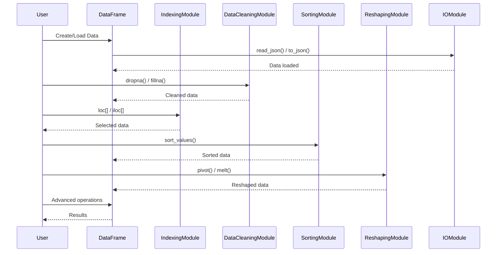

# Design Document: Comprehensive Pandas Features for node-pandas v3.0.0

## Overview

This design document outlines the implementation of all missing critical pandas features for node-pandas v3.0.0. The current version (v2.1.0) provides basic functionality including Series, DataFrame, CSV I/O, select, filter, groupBy, merge, concat, and basic statistics. Version 3.0.0 will add comprehensive data manipulation capabilities to make node-pandas feature-complete for most common data analysis tasks.

The implementation will maintain backward compatibility with v2.1.0, follow existing code patterns (CommonJS modules, class-based architecture, error handling with custom error classes), and provide full JSDoc documentation with comprehensive test coverage.

This is a major version release due to the significant feature additions, though all existing APIs remain unchanged.

## Architecture

```mermaid
graph TD
    A[DataFrame] --> B[Indexing Module]
    A --> C[Data Cleaning Module]
    A --> D[Sorting Module]
    A --> E[Reshaping Module]
    A --> F[I/O Module]
    
    G[Series] --> H[String Operations Module]
    G --> I[DateTime Operations Module]
    G --> J[Type Conversion Module]
    
    A --> K[Advanced Statistics Module]
    A --> L[Window Operations Module]
    A --> M[Time Series Module]
    
    B --> N[loc accessor]
    B --> O[iloc accessor]
    B --> P[at accessor]
    B --> Q[iat accessor]
    
    C --> R[dropna]
    C --> S[fillna]
    C --> T[drop_duplicates]
    C --> U[isna/notna]
    
    D --> V[sort_values]
    D --> W[sort_index]
    
    E --> X[pivot]
    E --> Y[pivot_table]
    E --> Z[melt]
    E --> AA[stack/unstack]
    
    F --> AB[JSON I/O]
    F --> AC[CSV I/O - existing]
    
    H --> AD[str accessor]
    I --> AE[dt accessor]
    
    K --> AF[corr/cov]
    L --> AG[rolling/expanding]
    M --> AH[resample]
```



## Main Algorithm/Workflow



## Components and Interfaces

### Component 1: Indexing Operations Module

**Purpose**: Provides label-based and position-based indexing for DataFrames and Series

**Interface**:
```javascript
class LocIndexer {
  constructor(dataframe)
  get(rowLabel, columnLabel)
  getRows(rowLabels)
  getColumns(columnLabels)
  set(rowLabel, columnLabel, value)
}

class ILocIndexer {
  constructor(dataframe)
  get(rowIndex, columnIndex)
  getRows(rowIndices)
  getColumns(columnIndices)
  set(rowIndex, columnIndex, value)
}

class AtIndexer {
  constructor(dataframe)
  get(rowLabel, columnLabel)
  set(rowLabel, columnLabel, value)
}

class IAtIndexer {
  constructor(dataframe)
  get(rowIndex, columnIndex)
  set(rowIndex, columnIndex, value)
}
```

**Responsibilities**:
- Provide label-based indexing (loc, at)
- Provide position-based indexing (iloc, iat)
- Support single value, row, column, and slice access
- Handle setting values through indexers


### Component 2: Data Cleaning Module

**Purpose**: Handles missing data and duplicate removal

**Interface**:
```javascript
class DataCleaning {
  static dropna(dataframe, options)
  static fillna(dataframe, value, options)
  static drop_duplicates(dataframe, options)
  static isna(dataframe)
  static notna(dataframe)
}
```

**Responsibilities**:
- Remove rows/columns with missing values
- Fill missing values with specified values or strategies
- Identify and remove duplicate rows
- Detect missing values (null, undefined, NaN)

### Component 3: Sorting Module

**Purpose**: Sorts DataFrames by values or index

**Interface**:
```javascript
class Sorting {
  static sort_values(dataframe, by, options)
  static sort_index(dataframe, options)
}
```

**Responsibilities**:
- Sort by one or multiple columns
- Sort by index labels
- Support ascending/descending order
- Handle missing values during sorting

### Component 4: Reshaping Module

**Purpose**: Transforms DataFrame structure through pivoting, melting, stacking

**Interface**:
```javascript
class Reshaping {
  static pivot(dataframe, options)
  static pivot_table(dataframe, options)
  static melt(dataframe, options)
  static stack(dataframe, options)
  static unstack(dataframe, options)
}
```

**Responsibilities**:
- Pivot data from long to wide format
- Create pivot tables with aggregations
- Melt data from wide to long format
- Stack/unstack multi-level indices


### Component 5: I/O Module Extensions

**Purpose**: Extends I/O capabilities with JSON support

**Interface**:
```javascript
class JsonIO {
  static read_json(filepath, options)
  static to_json(dataframe, filepath, options)
}
```

**Responsibilities**:
- Read JSON files into DataFrames
- Write DataFrames to JSON files
- Support various JSON orientations (records, columns, index, values)
- Handle nested JSON structures

### Component 6: String Operations Module

**Purpose**: Provides string manipulation methods for Series

**Interface**:
```javascript
class StringAccessor {
  constructor(series)
  lower()
  upper()
  capitalize()
  strip()
  replace(pattern, replacement)
  contains(pattern)
  startsWith(pattern)
  endsWith(pattern)
  split(delimiter)
  slice(start, end)
  len()
}
```

**Responsibilities**:
- Vectorized string operations on Series
- Pattern matching and replacement
- String transformations
- String slicing and splitting

### Component 7: DateTime Operations Module

**Purpose**: Handles datetime parsing and time series operations

**Interface**:
```javascript
class DateTimeAccessor {
  constructor(series)
  year()
  month()
  day()
  hour()
  minute()
  second()
  dayOfWeek()
  dayOfYear()
  quarter()
  strftime(format)
}

class DateTimeUtils {
  static to_datetime(data, options)
}
```

**Responsibilities**:
- Parse strings to datetime objects
- Extract datetime components
- Format datetime values
- Support datetime arithmetic


### Component 8: Advanced Statistics Module

**Purpose**: Provides correlation, covariance, and enhanced describe functionality

**Interface**:
```javascript
class AdvancedStats {
  static corr(dataframe, options)
  static cov(dataframe, options)
  static describe_enhanced(dataframe, options)
}
```

**Responsibilities**:
- Calculate correlation matrices
- Calculate covariance matrices
- Provide comprehensive statistical summaries
- Support different correlation methods (pearson, spearman, kendall)

### Component 9: Window Operations Module

**Purpose**: Implements rolling and expanding window calculations

**Interface**:
```javascript
class RollingWindow {
  constructor(dataframe, window, options)
  mean()
  sum()
  min()
  max()
  std()
  var()
  count()
  apply(fn)
}

class ExpandingWindow {
  constructor(dataframe, options)
  mean()
  sum()
  min()
  max()
  std()
  var()
  count()
  apply(fn)
}
```

**Responsibilities**:
- Calculate rolling window statistics
- Calculate expanding window statistics
- Support custom aggregation functions
- Handle edge cases and missing values

### Component 10: Time Series Module

**Purpose**: Provides time-based resampling and frequency conversion

**Interface**:
```javascript
class Resampler {
  constructor(dataframe, rule, options)
  mean()
  sum()
  min()
  max()
  count()
  first()
  last()
  apply(fn)
}
```

**Responsibilities**:
- Resample time series data to different frequencies
- Support various aggregation methods
- Handle datetime indices
- Support upsampling and downsampling


### Component 11: Type Operations Module

**Purpose**: Handles data type conversion and categorical data

**Interface**:
```javascript
class TypeOperations {
  static astype(dataframe, dtype, options)
  static to_numeric(series, options)
  static to_categorical(series, options)
  static infer_types(dataframe)
}

class CategoricalData {
  constructor(data, categories, ordered)
  get categories()
  get codes()
  add_categories(new_categories)
  remove_categories(removals)
  rename_categories(mapping)
}
```

**Responsibilities**:
- Convert data types (string, number, boolean, datetime)
- Create and manage categorical data
- Improve type inference
- Handle type conversion errors gracefully

## Data Models

### Model 1: LocIndexer

```javascript
class LocIndexer {
  _dataframe: DataFrame
  
  constructor(dataframe) {
    this._dataframe = dataframe
  }
  
  get(rowLabel, columnLabel) {
    // Returns value at specified label position
  }
}
```

**Validation Rules**:
- rowLabel must exist in DataFrame index
- columnLabel must exist in DataFrame columns
- Returns single value, Series, or DataFrame depending on input

### Model 2: DataCleaningOptions

```javascript
interface DropnaOptions {
  axis: 0 | 1  // 0 for rows, 1 for columns
  how: 'any' | 'all'  // 'any' drops if any null, 'all' drops if all null
  thresh: number  // Minimum number of non-null values required
  subset: string[]  // Column names to consider
}

interface FillnaOptions {
  method: 'ffill' | 'bfill' | 'value'  // Forward fill, backward fill, or value
  value: any  // Value to fill with
  limit: number  // Maximum number of consecutive fills
  axis: 0 | 1
}
```

**Validation Rules**:
- axis must be 0 or 1
- how must be 'any' or 'all'
- thresh must be positive integer
- subset columns must exist in DataFrame


### Model 3: SortingOptions

```javascript
interface SortOptions {
  ascending: boolean | boolean[]  // Sort order
  na_position: 'first' | 'last'  // Where to place null values
  inplace: boolean  // Modify in place or return new DataFrame
  kind: 'quicksort' | 'mergesort' | 'heapsort'  // Sort algorithm
}
```

**Validation Rules**:
- ascending can be boolean or array of booleans matching number of sort keys
- na_position must be 'first' or 'last'
- kind must be valid sort algorithm name

### Model 4: PivotOptions

```javascript
interface PivotOptions {
  index: string | string[]  // Column(s) to use as row index
  columns: string | string[]  // Column(s) to use as column headers
  values: string | string[]  // Column(s) to aggregate
  aggfunc: string | Function  // Aggregation function
  fill_value: any  // Value to replace missing values
}
```

**Validation Rules**:
- index, columns, values must reference existing columns
- aggfunc must be valid aggregation function or custom function
- No overlap between index, columns, and values

### Model 5: WindowOptions

```javascript
interface RollingOptions {
  window: number  // Window size
  min_periods: number  // Minimum observations required
  center: boolean  // Center the window
  win_type: string  // Window type (e.g., 'boxcar', 'triang')
  closed: 'right' | 'left' | 'both' | 'neither'  // Which side is closed
}
```

**Validation Rules**:
- window must be positive integer
- min_periods must be <= window
- closed must be valid option

### Model 6: CategoricalOptions

```javascript
interface CategoricalOptions {
  categories: any[]  // List of valid categories
  ordered: boolean  // Whether categories have order
  dtype: string  // Data type of categories
}
```

**Validation Rules**:
- categories must be unique
- All data values must be in categories or null
- ordered must be boolean


## Algorithmic Pseudocode

### Main Indexing Algorithm (loc)

```javascript
/**
 * Label-based indexing algorithm
 * 
 * Preconditions:
 * - dataframe is valid DataFrame instance
 * - rowLabel exists in dataframe.index
 * - columnLabel exists in dataframe.columns (if provided)
 * 
 * Postconditions:
 * - Returns value, Series, or DataFrame based on input
 * - No modification to original dataframe
 * - Throws error if labels don't exist
 */
function locGet(dataframe, rowLabel, columnLabel) {
  // Validate row label exists
  if (!dataframe.index.includes(rowLabel)) {
    throw new IndexError(`Row label '${rowLabel}' not found`)
  }
  
  // Get row index from label
  const rowIndex = dataframe.index.indexOf(rowLabel)
  
  // If no column specified, return entire row as Series
  if (columnLabel === undefined) {
    return new Series(
      dataframe.columns.map(col => dataframe.getCell(rowIndex, col)),
      { index: dataframe.columns, name: rowLabel }
    )
  }
  
  // Validate column label exists
  if (!dataframe.columns.includes(columnLabel)) {
    throw new ColumnError(`Column label '${columnLabel}' not found`)
  }
  
  // Return single value
  return dataframe.getCell(rowIndex, columnLabel)
}
```

### Data Cleaning Algorithm (dropna)

```javascript
/**
 * Drop rows/columns with missing values
 * 
 * Preconditions:
 * - dataframe is valid DataFrame instance
 * - options.axis is 0 or 1
 * - options.how is 'any' or 'all'
 * - options.subset columns exist in dataframe (if provided)
 * 
 * Postconditions:
 * - Returns new DataFrame with missing values removed
 * - Original dataframe unchanged
 * - Result has same or fewer rows/columns
 * 
 * Loop Invariants:
 * - All processed rows/columns meet the non-null criteria
 * - Column structure preserved when dropping rows (axis=0)
 * - Row count preserved when dropping columns (axis=1)
 */
function dropna(dataframe, options = {}) {
  const { axis = 0, how = 'any', thresh = null, subset = null } = options
  
  // Determine columns to check
  const columnsToCheck = subset || dataframe.columns
  
  if (axis === 0) {
    // Drop rows
    const filteredRows = []
    
    for (let i = 0; i < dataframe.rows; i++) {
      const row = dataframe.getRow(i)
      const values = columnsToCheck.map(col => row[col])
      
      // Count non-null values
      const nonNullCount = values.filter(v => !isNull(v)).length
      
      // Determine if row should be kept
      let keepRow = false
      if (thresh !== null) {
        keepRow = nonNullCount >= thresh
      } else if (how === 'any') {
        keepRow = nonNullCount === values.length  // No nulls
      } else {  // how === 'all'
        keepRow = nonNullCount > 0  // At least one non-null
      }
      
      if (keepRow) {
        filteredRows.push(dataframe.columns.map(col => row[col]))
      }
    }
    
    return new DataFrame(filteredRows, dataframe.columns)
  } else {
    // Drop columns (axis === 1)
    const columnsToKeep = []
    
    for (const col of dataframe.columns) {
      const values = []
      for (let i = 0; i < dataframe.rows; i++) {
        values.push(dataframe.getCell(i, col))
      }
      
      const nonNullCount = values.filter(v => !isNull(v)).length
      
      let keepColumn = false
      if (thresh !== null) {
        keepColumn = nonNullCount >= thresh
      } else if (how === 'any') {
        keepColumn = nonNullCount === values.length
      } else {
        keepColumn = nonNullCount > 0
      }
      
      if (keepColumn) {
        columnsToKeep.push(col)
      }
    }
    
    return dataframe.select(columnsToKeep)
  }
}
```


### Sorting Algorithm (sort_values)

```javascript
/**
 * Sort DataFrame by column values
 * 
 * Preconditions:
 * - dataframe is valid DataFrame instance
 * - by columns exist in dataframe
 * - ascending is boolean or array of booleans matching by length
 * 
 * Postconditions:
 * - Returns new sorted DataFrame
 * - Original dataframe unchanged
 * - All rows preserved, only order changed
 * - Null values positioned according to na_position
 * 
 * Loop Invariants:
 * - Comparison function maintains sort stability
 * - All rows remain complete during sorting
 */
function sort_values(dataframe, by, options = {}) {
  const { ascending = true, na_position = 'last' } = options
  
  // Normalize by to array
  const sortColumns = Array.isArray(by) ? by : [by]
  
  // Normalize ascending to array
  const ascendingArray = Array.isArray(ascending) 
    ? ascending 
    : sortColumns.map(() => ascending)
  
  // Validate columns exist
  for (const col of sortColumns) {
    if (!dataframe.columns.includes(col)) {
      throw new ColumnError(`Column '${col}' not found`)
    }
  }
  
  // Create array of row indices with data
  const rowsWithIndices = []
  for (let i = 0; i < dataframe.rows; i++) {
    rowsWithIndices.push({
      index: i,
      row: dataframe.getRow(i)
    })
  }
  
  // Sort using comparison function
  rowsWithIndices.sort((a, b) => {
    for (let i = 0; i < sortColumns.length; i++) {
      const col = sortColumns[i]
      const aVal = a.row[col]
      const bVal = b.row[col]
      const asc = ascendingArray[i]
      
      // Handle null values
      const aIsNull = isNull(aVal)
      const bIsNull = isNull(bVal)
      
      if (aIsNull && bIsNull) continue
      if (aIsNull) return na_position === 'first' ? -1 : 1
      if (bIsNull) return na_position === 'first' ? 1 : -1
      
      // Compare values
      let comparison = 0
      if (aVal < bVal) comparison = -1
      else if (aVal > bVal) comparison = 1
      
      if (comparison !== 0) {
        return asc ? comparison : -comparison
      }
    }
    return 0
  })
  
  // Build sorted data
  const sortedData = rowsWithIndices.map(item => 
    dataframe.columns.map(col => item.row[col])
  )
  
  return new DataFrame(sortedData, dataframe.columns)
}
```


### Pivot Algorithm

```javascript
/**
 * Pivot DataFrame from long to wide format
 * 
 * Preconditions:
 * - dataframe is valid DataFrame instance
 * - index, columns, values exist in dataframe
 * - No duplicate (index, columns) combinations
 * 
 * Postconditions:
 * - Returns new pivoted DataFrame
 * - Original dataframe unchanged
 * - New columns are unique values from columns parameter
 * - New index is unique values from index parameter
 * 
 * Loop Invariants:
 * - Each (index, column) combination maps to exactly one value
 * - All original data preserved in pivoted structure
 */
function pivot(dataframe, options) {
  const { index, columns, values } = options
  
  // Validate columns exist
  if (!dataframe.columns.includes(index)) {
    throw new ColumnError(`Index column '${index}' not found`)
  }
  if (!dataframe.columns.includes(columns)) {
    throw new ColumnError(`Columns parameter '${columns}' not found`)
  }
  if (!dataframe.columns.includes(values)) {
    throw new ColumnError(`Values column '${values}' not found`)
  }
  
  // Get unique values for new index and columns
  const uniqueIndex = [...new Set(
    Array.from({ length: dataframe.rows }, (_, i) => 
      dataframe.getCell(i, index)
    )
  )].sort()
  
  const uniqueColumns = [...new Set(
    Array.from({ length: dataframe.rows }, (_, i) => 
      dataframe.getCell(i, columns)
    )
  )].sort()
  
  // Build pivot table
  const pivotData = new Map()
  
  for (let i = 0; i < dataframe.rows; i++) {
    const row = dataframe.getRow(i)
    const indexVal = row[index]
    const colVal = row[columns]
    const value = row[values]
    
    const key = JSON.stringify([indexVal, colVal])
    
    if (pivotData.has(key)) {
      throw new Error(`Duplicate entry for index=${indexVal}, column=${colVal}`)
    }
    
    pivotData.set(key, value)
  }
  
  // Build result DataFrame
  const resultData = []
  for (const indexVal of uniqueIndex) {
    const row = []
    for (const colVal of uniqueColumns) {
      const key = JSON.stringify([indexVal, colVal])
      row.push(pivotData.get(key) || null)
    }
    resultData.push(row)
  }
  
  return new DataFrame(resultData, uniqueColumns)
}
```


### Rolling Window Algorithm

```javascript
/**
 * Calculate rolling window statistics
 * 
 * Preconditions:
 * - dataframe is valid DataFrame instance
 * - window is positive integer
 * - min_periods <= window
 * - aggregation function is valid
 * 
 * Postconditions:
 * - Returns new DataFrame with rolling statistics
 * - Original dataframe unchanged
 * - Result has same shape as input
 * - First (window-1) values may be null if min_periods not met
 * 
 * Loop Invariants:
 * - Window size remains constant throughout iteration
 * - Each window contains exactly window elements (or fewer at edges)
 * - Aggregation applied consistently to each window
 */
function rolling(dataframe, window, aggFunc, options = {}) {
  const { min_periods = window, center = false } = options
  
  // Validate window size
  if (window <= 0) {
    throw new ValidationError('Window must be positive integer')
  }
  if (min_periods > window) {
    throw new ValidationError('min_periods cannot exceed window size')
  }
  
  const resultData = []
  
  for (let i = 0; i < dataframe.rows; i++) {
    const row = {}
    
    for (const col of dataframe.columns) {
      // Determine window boundaries
      let start, end
      if (center) {
        const offset = Math.floor(window / 2)
        start = Math.max(0, i - offset)
        end = Math.min(dataframe.rows, i + offset + 1)
      } else {
        start = Math.max(0, i - window + 1)
        end = i + 1
      }
      
      // Extract window values
      const windowValues = []
      for (let j = start; j < end; j++) {
        const value = dataframe.getCell(j, col)
        if (!isNull(value)) {
          windowValues.push(value)
        }
      }
      
      // Apply aggregation if min_periods met
      if (windowValues.length >= min_periods) {
        row[col] = aggFunc(windowValues)
      } else {
        row[col] = null
      }
    }
    
    resultData.push(dataframe.columns.map(col => row[col]))
  }
  
  return new DataFrame(resultData, dataframe.columns)
}
```

### String Operations Algorithm

```javascript
/**
 * Vectorized string operations on Series
 * 
 * Preconditions:
 * - series contains string values (or null)
 * - operation is valid string method
 * 
 * Postconditions:
 * - Returns new Series with transformed strings
 * - Original series unchanged
 * - Null values preserved as null
 * - Non-string values handled gracefully
 * 
 * Loop Invariants:
 * - Each element processed independently
 * - Index preserved throughout transformation
 */
function stringOperation(series, operation, ...args) {
  const transformed = []
  
  for (let i = 0; i < series.length; i++) {
    const value = series[i]
    
    // Handle null/undefined
    if (isNull(value)) {
      transformed.push(null)
      continue
    }
    
    // Convert to string if not already
    const strValue = String(value)
    
    // Apply operation
    try {
      const result = strValue[operation](...args)
      transformed.push(result)
    } catch (error) {
      throw new OperationError(
        `String operation '${operation}' failed at index ${i}`,
        { value, operation, error: error.message }
      )
    }
  }
  
  return new Series(transformed, { index: series.index, name: series.name })
}
```


## Key Functions with Formal Specifications

### Function 1: DataFrame.loc (getter)

```javascript
/**
 * Label-based indexing accessor
 * 
 * @returns {LocIndexer} Indexer object for label-based access
 */
get loc() {
  return new LocIndexer(this)
}
```

**Preconditions:**
- DataFrame instance is valid and initialized
- DataFrame has defined index and columns

**Postconditions:**
- Returns LocIndexer instance bound to this DataFrame
- No modification to DataFrame state
- Indexer provides get/set methods for label-based access

**Loop Invariants:** N/A (property accessor)

### Function 2: DataFrame.dropna()

```javascript
/**
 * Remove missing values from DataFrame
 * 
 * @param {Object} options - Configuration options
 * @param {number} options.axis - 0 for rows, 1 for columns
 * @param {string} options.how - 'any' or 'all'
 * @param {number} options.thresh - Minimum non-null values required
 * @param {string[]} options.subset - Columns to consider
 * @returns {DataFrame} New DataFrame with missing values removed
 */
dropna(options = {})
```

**Preconditions:**
- DataFrame instance is valid
- options.axis is 0 or 1 (if provided)
- options.how is 'any' or 'all' (if provided)
- options.thresh is positive integer (if provided)
- options.subset columns exist in DataFrame (if provided)

**Postconditions:**
- Returns new DataFrame instance
- Original DataFrame unchanged
- Result has same or fewer rows (axis=0) or columns (axis=1)
- No rows/columns with missing values according to criteria
- Column structure preserved (axis=0) or row count preserved (axis=1)

**Loop Invariants:**
- When iterating rows (axis=0): all kept rows meet non-null criteria
- When iterating columns (axis=1): all kept columns meet non-null criteria
- Index/column alignment maintained throughout

### Function 3: DataFrame.sort_values()

```javascript
/**
 * Sort DataFrame by column values
 * 
 * @param {string|string[]} by - Column name(s) to sort by
 * @param {Object} options - Sort options
 * @param {boolean|boolean[]} options.ascending - Sort order
 * @param {string} options.na_position - 'first' or 'last'
 * @returns {DataFrame} New sorted DataFrame
 */
sort_values(by, options = {})
```

**Preconditions:**
- DataFrame instance is valid
- by columns exist in DataFrame
- options.ascending is boolean or array matching by length
- options.na_position is 'first' or 'last'

**Postconditions:**
- Returns new sorted DataFrame
- Original DataFrame unchanged
- All rows preserved, only order changed
- Rows sorted according to specified columns and order
- Null values positioned according to na_position
- Sort is stable (equal elements maintain relative order)

**Loop Invariants:**
- During sort comparison: all compared values follow consistent ordering rules
- Null handling consistent across all comparisons
- Multi-column sort maintains priority order


### Function 4: DataFrame.pivot()

```javascript
/**
 * Pivot DataFrame from long to wide format
 * 
 * @param {Object} options - Pivot configuration
 * @param {string} options.index - Column to use as row index
 * @param {string} options.columns - Column to use as column headers
 * @param {string} options.values - Column to aggregate
 * @returns {DataFrame} Pivoted DataFrame
 */
pivot(options)
```

**Preconditions:**
- DataFrame instance is valid
- options.index, options.columns, options.values exist in DataFrame
- No duplicate (index, columns) combinations in data
- All three parameters are different columns

**Postconditions:**
- Returns new pivoted DataFrame
- Original DataFrame unchanged
- New columns are unique values from columns parameter
- New index is unique values from index parameter
- Each cell contains value from values column for corresponding (index, column) pair
- Missing combinations filled with null

**Loop Invariants:**
- Each (index, column) combination processed exactly once
- All unique index values represented in result
- All unique column values represented in result

### Function 5: Series.str (accessor)

```javascript
/**
 * String operations accessor for Series
 * 
 * @returns {StringAccessor} Accessor object for string operations
 */
get str() {
  return new StringAccessor(this)
}
```

**Preconditions:**
- Series instance is valid
- Series contains string values (or null/undefined)

**Postconditions:**
- Returns StringAccessor instance bound to this Series
- No modification to Series state
- Accessor provides vectorized string methods

**Loop Invariants:** N/A (property accessor)

### Function 6: DataFrame.rolling()

```javascript
/**
 * Create rolling window for calculations
 * 
 * @param {number} window - Window size
 * @param {Object} options - Window options
 * @param {number} options.min_periods - Minimum observations required
 * @param {boolean} options.center - Center the window
 * @returns {RollingWindow} Rolling window object
 */
rolling(window, options = {})
```

**Preconditions:**
- DataFrame instance is valid
- window is positive integer
- options.min_periods <= window (if provided)
- options.center is boolean (if provided)

**Postconditions:**
- Returns RollingWindow instance
- No modification to DataFrame state
- Window object provides aggregation methods (mean, sum, etc.)
- Aggregations return new DataFrame with same shape

**Loop Invariants:** N/A (returns window object, not direct computation)


### Function 7: DataFrame.fillna()

```javascript
/**
 * Fill missing values with specified value or method
 * 
 * @param {*} value - Value to fill or fill method
 * @param {Object} options - Fill options
 * @param {string} options.method - 'ffill', 'bfill', or null
 * @param {number} options.limit - Maximum consecutive fills
 * @returns {DataFrame} DataFrame with filled values
 */
fillna(value, options = {})
```

**Preconditions:**
- DataFrame instance is valid
- If method specified, must be 'ffill' or 'bfill'
- options.limit is positive integer (if provided)
- value is provided if method is null

**Postconditions:**
- Returns new DataFrame with missing values filled
- Original DataFrame unchanged
- All null/undefined/NaN values replaced according to strategy
- Non-null values unchanged
- If limit specified, at most limit consecutive nulls filled

**Loop Invariants:**
- For ffill: each null filled with most recent non-null value
- For bfill: each null filled with next non-null value
- Consecutive fill counter resets at non-null values

### Function 8: DataFrame.melt()

```javascript
/**
 * Unpivot DataFrame from wide to long format
 * 
 * @param {Object} options - Melt configuration
 * @param {string[]} options.id_vars - Columns to keep as identifiers
 * @param {string[]} options.value_vars - Columns to unpivot
 * @param {string} options.var_name - Name for variable column
 * @param {string} options.value_name - Name for value column
 * @returns {DataFrame} Melted DataFrame
 */
melt(options = {})
```

**Preconditions:**
- DataFrame instance is valid
- id_vars columns exist in DataFrame (if provided)
- value_vars columns exist in DataFrame (if provided)
- id_vars and value_vars don't overlap

**Postconditions:**
- Returns new melted DataFrame
- Original DataFrame unchanged
- Result has columns: id_vars + [var_name, value_name]
- Each row in result represents one value from original wide format
- Number of rows = original_rows × number_of_value_vars

**Loop Invariants:**
- Each value_var processed creates original_rows new rows
- id_vars values repeated for each value_var
- All original data preserved in long format

### Function 9: DataFrame.astype()

```javascript
/**
 * Convert DataFrame columns to specified data types
 * 
 * @param {Object|string} dtype - Type specification (column->type map or single type)
 * @param {Object} options - Conversion options
 * @param {boolean} options.errors - 'raise' or 'ignore'
 * @returns {DataFrame} DataFrame with converted types
 */
astype(dtype, options = {})
```

**Preconditions:**
- DataFrame instance is valid
- dtype is valid type specification
- If dtype is object, keys are valid column names
- Type names are valid: 'string', 'number', 'boolean', 'datetime'

**Postconditions:**
- Returns new DataFrame with converted types
- Original DataFrame unchanged
- All specified columns converted to target types
- If errors='raise', throws on conversion failure
- If errors='ignore', keeps original value on conversion failure

**Loop Invariants:**
- Each column processed independently
- Type conversion applied consistently within column
- Non-convertible values handled according to errors option


## Example Usage

### Indexing Operations

```javascript
const df = DataFrame(
  [[1, 'Alice', 25], [2, 'Bob', 30], [3, 'Charlie', 35]],
  ['id', 'name', 'age']
)

// Label-based indexing
const value = df.loc.get(0, 'name')  // 'Alice'
const row = df.loc.getRows([0, 2])   // DataFrame with rows 0 and 2
df.loc.set(1, 'age', 31)             // Set value at row 1, column 'age'

// Position-based indexing
const value2 = df.iloc.get(0, 1)     // 'Alice' (row 0, column 1)
const subset = df.iloc.getRows([0, 2])  // First and third rows

// Fast scalar access
const fast = df.at.get(0, 'name')    // 'Alice' (optimized for single value)
const fast2 = df.iat.get(0, 1)       // 'Alice' (position-based)
```

### Data Cleaning

```javascript
const df = DataFrame(
  [[1, 'Alice', null], [2, null, 30], [3, 'Charlie', 35], [null, null, null]],
  ['id', 'name', 'age']
)

// Drop rows with any null values
const cleaned1 = df.dropna()  // Only row with Charlie remains

// Drop rows with all null values
const cleaned2 = df.dropna({ how: 'all' })  // Removes last row only

// Drop columns with any null values
const cleaned3 = df.dropna({ axis: 1 })  // All columns have nulls, returns empty

// Require at least 2 non-null values
const cleaned4 = df.dropna({ thresh: 2 })  // Keeps first 3 rows

// Fill null values with 0
const filled1 = df.fillna(0)

// Forward fill (propagate last valid value)
const filled2 = df.fillna(null, { method: 'ffill' })

// Backward fill
const filled3 = df.fillna(null, { method: 'bfill' })

// Check for null values
const nullMask = df.isna()  // DataFrame of booleans
const notNullMask = df.notna()  // Inverse of isna()

// Remove duplicate rows
const df2 = DataFrame(
  [[1, 'Alice'], [2, 'Bob'], [1, 'Alice'], [3, 'Charlie']],
  ['id', 'name']
)
const unique = df2.drop_duplicates()  // Removes third row
```

### Sorting

```javascript
const df = DataFrame(
  [[3, 'Charlie', 35], [1, 'Alice', 25], [2, 'Bob', 30]],
  ['id', 'name', 'age']
)

// Sort by single column
const sorted1 = df.sort_values('age')  // Ascending by age

// Sort descending
const sorted2 = df.sort_values('age', { ascending: false })

// Sort by multiple columns
const sorted3 = df.sort_values(['age', 'name'])

// Mixed ascending/descending
const sorted4 = df.sort_values(['age', 'name'], { 
  ascending: [true, false] 
})

// Handle null values
const df2 = DataFrame(
  [[1, 'Alice', null], [2, 'Bob', 30], [3, 'Charlie', 25]],
  ['id', 'name', 'age']
)
const sorted5 = df2.sort_values('age', { na_position: 'first' })

// Sort by index
const sorted6 = df.sort_index()
const sorted7 = df.sort_index({ ascending: false })
```


### Reshaping

```javascript
// Pivot example
const df = DataFrame(
  [
    ['2023-01', 'Product A', 100],
    ['2023-01', 'Product B', 150],
    ['2023-02', 'Product A', 120],
    ['2023-02', 'Product B', 180]
  ],
  ['month', 'product', 'sales']
)

const pivoted = df.pivot({
  index: 'month',
  columns: 'product',
  values: 'sales'
})
// Result:
//           Product A  Product B
// 2023-01      100        150
// 2023-02      120        180

// Pivot table with aggregation
const df2 = DataFrame(
  [
    ['2023-01', 'Product A', 'Store 1', 100],
    ['2023-01', 'Product A', 'Store 2', 110],
    ['2023-01', 'Product B', 'Store 1', 150],
    ['2023-02', 'Product A', 'Store 1', 120]
  ],
  ['month', 'product', 'store', 'sales']
)

const pivotTable = df2.pivot_table({
  index: 'month',
  columns: 'product',
  values: 'sales',
  aggfunc: 'mean'
})

// Melt (unpivot)
const wide = DataFrame(
  [
    ['Alice', 25, 30, 28],
    ['Bob', 30, 35, 32]
  ],
  ['name', 'Q1', 'Q2', 'Q3']
)

const melted = wide.melt({
  id_vars: ['name'],
  value_vars: ['Q1', 'Q2', 'Q3'],
  var_name: 'quarter',
  value_name: 'score'
})
// Result:
//    name  quarter  score
// 0  Alice    Q1      25
// 1  Alice    Q2      30
// 2  Alice    Q3      28
// 3  Bob      Q1      30
// 4  Bob      Q2      35
// 5  Bob      Q3      32

// Stack and unstack
const stacked = df.stack()    // Convert columns to rows
const unstacked = df.unstack()  // Convert rows to columns
```

### JSON I/O

```javascript
// Read JSON file
const df = DataFrame.read_json('data.json')

// Read with specific orientation
const df2 = DataFrame.read_json('data.json', { orient: 'records' })
// orient options: 'records', 'columns', 'index', 'values'

// Write to JSON
df.to_json('output.json')

// Write with specific orientation
df.to_json('output.json', { orient: 'records', indent: 2 })

// Example JSON formats:
// orient='records': [{"col1": val1, "col2": val2}, ...]
// orient='columns': {"col1": [val1, val2], "col2": [val3, val4]}
// orient='index': {"row1": {"col1": val1}, "row2": {"col1": val2}}
```

### String Operations

```javascript
const df = DataFrame(
  [[1, 'Alice Smith'], [2, 'bob jones'], [3, 'CHARLIE BROWN']],
  ['id', 'name']
)

// Access string methods via .str accessor
const lower = df.name.str.lower()  // Series(['alice smith', 'bob jones', 'charlie brown'])
const upper = df.name.str.upper()  // Series(['ALICE SMITH', 'BOB JONES', 'CHARLIE BROWN'])

// String operations
const capitalized = df.name.str.capitalize()  // Capitalize first letter
const stripped = df.name.str.strip()          // Remove whitespace
const replaced = df.name.str.replace('Smith', 'Johnson')

// Pattern matching
const contains = df.name.str.contains('Alice')  // Series([true, false, false])
const startsWith = df.name.str.startsWith('A')  // Series([true, false, false])
const endsWith = df.name.str.endsWith('n')      // Series([false, false, true])

// String slicing
const firstNames = df.name.str.split(' ').map(parts => parts[0])
const sliced = df.name.str.slice(0, 5)  // First 5 characters

// String length
const lengths = df.name.str.len()  // Series([11, 9, 13])
```


### DateTime Operations

```javascript
// Parse strings to datetime
const dates = Series(['2023-01-15', '2023-02-20', '2023-03-25'])
const datetimes = dates.dt.to_datetime()

// Access datetime components
const df = DataFrame(
  [
    ['2023-01-15 10:30:00', 100],
    ['2023-02-20 14:45:00', 150],
    ['2023-03-25 09:15:00', 120]
  ],
  ['timestamp', 'value']
)

// Convert to datetime
df.timestamp = df.timestamp.dt.to_datetime()

// Extract components
const years = df.timestamp.dt.year()        // Series([2023, 2023, 2023])
const months = df.timestamp.dt.month()      // Series([1, 2, 3])
const days = df.timestamp.dt.day()          // Series([15, 20, 25])
const hours = df.timestamp.dt.hour()        // Series([10, 14, 9])
const dayOfWeek = df.timestamp.dt.dayOfWeek()  // Series([0, 1, 6]) (0=Monday)
const quarter = df.timestamp.dt.quarter()   // Series([1, 1, 1])

// Format datetime
const formatted = df.timestamp.dt.strftime('%Y-%m-%d')  // Series(['2023-01-15', ...])

// Time series operations with datetime index
const tsData = DataFrame(
  [[100], [150], [120]],
  ['value']
)
tsData.index = ['2023-01-15', '2023-02-20', '2023-03-25']

// Resample to different frequency
const monthly = tsData.resample('M').mean()  // Monthly average
const weekly = tsData.resample('W').sum()    // Weekly sum
```

### Advanced Statistics

```javascript
const df = DataFrame(
  [[1, 2, 3], [4, 5, 6], [7, 8, 9]],
  ['A', 'B', 'C']
)

// Correlation matrix
const corrMatrix = df.corr()
// Result: DataFrame showing correlation between all numeric columns
//      A     B     C
// A  1.0   1.0   1.0
// B  1.0   1.0   1.0
// C  1.0   1.0   1.0

// Correlation with specific method
const spearman = df.corr({ method: 'spearman' })
const kendall = df.corr({ method: 'kendall' })

// Covariance matrix
const covMatrix = df.cov()

// Enhanced describe with percentiles
const stats = df.describe({ percentiles: [0.1, 0.25, 0.5, 0.75, 0.9] })
// Includes: count, mean, std, min, 10%, 25%, 50%, 75%, 90%, max
```

### Window Operations

```javascript
const df = DataFrame(
  [[1, 10], [2, 20], [3, 30], [4, 40], [5, 50]],
  ['id', 'value']
)

// Rolling window (moving average)
const rolling3 = df.rolling(3).mean()
// Result:
//    id  value
// 0  NaN   NaN
// 1  NaN   NaN
// 2  2.0  20.0
// 3  3.0  30.0
// 4  4.0  40.0

// Rolling with minimum periods
const rolling2 = df.rolling(3, { min_periods: 1 }).mean()
// Computes mean even with fewer than 3 values

// Centered rolling window
const centered = df.rolling(3, { center: true }).mean()

// Rolling with different aggregations
const rollingSum = df.rolling(3).sum()
const rollingMax = df.rolling(3).max()
const rollingMin = df.rolling(3).min()
const rollingStd = df.rolling(3).std()

// Custom rolling function
const rollingCustom = df.rolling(3).apply(values => {
  return Math.max(...values) - Math.min(...values)  // Range
})

// Expanding window (cumulative)
const expanding = df.expanding().mean()
// Result:
//    id  value
// 0  1.0  10.0
// 1  1.5  15.0
// 2  2.0  20.0
// 3  2.5  25.0
// 4  3.0  30.0

const expandingSum = df.expanding().sum()  // Cumulative sum
```


### Type Conversion

```javascript
const df = DataFrame(
  [['1', '2.5', 'true'], ['2', '3.7', 'false'], ['3', '4.2', 'true']],
  ['id', 'value', 'flag']
)

// Convert single column
const df2 = df.astype({ id: 'number' })
// df2.id is now numeric: [1, 2, 3]

// Convert multiple columns
const df3 = df.astype({
  id: 'number',
  value: 'number',
  flag: 'boolean'
})

// Convert all columns to same type
const df4 = df.astype('string')

// Handle conversion errors
const df5 = df.astype({ id: 'number' }, { errors: 'ignore' })
// Keeps original value if conversion fails

// Convert to numeric with error handling
const series = Series(['1', '2', 'invalid', '4'])
const numeric = series.astype('number', { errors: 'coerce' })
// Result: [1, 2, NaN, 4]

// Categorical data
const categories = Series(['red', 'blue', 'red', 'green', 'blue', 'red'])
const categorical = categories.astype('category')

// Access categorical properties
console.log(categorical.cat.categories)  // ['red', 'blue', 'green']
console.log(categorical.cat.codes)       // [0, 1, 0, 2, 1, 0]

// Ordered categorical
const sizes = Series(['small', 'large', 'medium', 'small', 'large'])
const orderedCat = sizes.astype('category', {
  categories: ['small', 'medium', 'large'],
  ordered: true
})
```

## Correctness Properties

### Universal Quantification Statements

1. **Indexing Consistency**: ∀ DataFrame df, ∀ valid label l, ∀ valid column c: df.loc.get(l, c) === df.getCell(df.index.indexOf(l), c)

2. **Data Preservation**: ∀ DataFrame df, ∀ operation op ∈ {dropna, fillna, sort_values, pivot, melt}: op(df) preserves all non-null data values (possibly in different structure)

3. **Immutability**: ∀ DataFrame df, ∀ transformation t: t(df) returns new DataFrame AND original df unchanged

4. **Index Alignment**: ∀ Series s, ∀ string operation op: s.str.op().index === s.index

5. **Window Size**: ∀ DataFrame df, ∀ window w, ∀ position i: rolling(df, w)[i] computed from df[max(0, i-w+1):i+1]

6. **Type Conversion**: ∀ DataFrame df, ∀ column c, ∀ type t: astype(df, {c: t}) converts all values in column c to type t (or throws/coerces based on error handling)

7. **Null Handling**: ∀ DataFrame df: dropna(df, {how: 'any'}) contains no null values

8. **Sort Stability**: ∀ DataFrame df, ∀ column c: sort_values(df, c) maintains relative order of rows with equal values in c

9. **Pivot Uniqueness**: ∀ DataFrame df, ∀ pivot operation: each (index, column) combination in result corresponds to exactly one value in original data

10. **Rolling Consistency**: ∀ DataFrame df, ∀ window w: rolling(df, w).mean()[i] === mean(df[max(0,i-w+1):i+1]) for all valid i

11. **String Vectorization**: ∀ Series s containing strings, ∀ string method m: s.str.m() applies m to each element independently

12. **DateTime Component Extraction**: ∀ Series s of datetimes, ∀ component c ∈ {year, month, day}: s.dt.c() extracts component c from each datetime

13. **Correlation Symmetry**: ∀ DataFrame df: corr(df)[i][j] === corr(df)[j][i] (correlation matrix is symmetric)

14. **Fill Forward Propagation**: ∀ DataFrame df: fillna(df, {method: 'ffill'})[i][c] equals last non-null value in df[:i+1][c]

15. **Melt Cardinality**: ∀ DataFrame df with n rows and m value columns: melt(df) has n × m rows


## Error Handling

### Error Scenario 1: Invalid Index Label

**Condition**: User attempts to access row/column with non-existent label via loc
**Response**: Throw IndexError with descriptive message including valid labels
**Recovery**: User must use valid label from DataFrame.index or DataFrame.columns

```javascript
try {
  const value = df.loc.get('nonexistent', 'age')
} catch (error) {
  // IndexError: Row label 'nonexistent' not found in index [0, 1, 2]
  console.error(error.message)
}
```

### Error Scenario 2: Type Conversion Failure

**Condition**: astype() cannot convert value to target type
**Response**: Based on errors option:
  - 'raise': Throw TypeError with failing value and position
  - 'ignore': Keep original value
  - 'coerce': Replace with null/NaN
**Recovery**: User can handle error or use different error strategy

```javascript
// Raise error
try {
  df.astype({ age: 'number' }, { errors: 'raise' })
} catch (error) {
  // TypeError: Cannot convert 'invalid' to number at row 2
}

// Ignore errors
const df2 = df.astype({ age: 'number' }, { errors: 'ignore' })
// Non-convertible values remain as original type

// Coerce to null
const df3 = df.astype({ age: 'number' }, { errors: 'coerce' })
// Non-convertible values become null
```

### Error Scenario 3: Duplicate Pivot Keys

**Condition**: pivot() encounters duplicate (index, columns) combinations
**Response**: Throw ValidationError indicating duplicate key
**Recovery**: User must use pivot_table() with aggregation function or deduplicate data

```javascript
try {
  df.pivot({ index: 'date', columns: 'product', values: 'sales' })
} catch (error) {
  // ValidationError: Duplicate entry for index='2023-01', column='Product A'
  // Use pivot_table() with aggfunc to aggregate duplicates
}
```

### Error Scenario 4: Invalid Window Size

**Condition**: rolling() called with window <= 0 or min_periods > window
**Response**: Throw ValidationError with constraint explanation
**Recovery**: User must provide valid window parameters

```javascript
try {
  df.rolling(0).mean()
} catch (error) {
  // ValidationError: Window must be positive integer, got 0
}

try {
  df.rolling(3, { min_periods: 5 }).mean()
} catch (error) {
  // ValidationError: min_periods (5) cannot exceed window size (3)
}
```

### Error Scenario 5: Missing Required Columns

**Condition**: Operation references columns that don't exist in DataFrame
**Response**: Throw ColumnError listing missing columns and available columns
**Recovery**: User must use correct column names or add missing columns

```javascript
try {
  df.sort_values(['age', 'salary'])
} catch (error) {
  // ColumnError: Column 'salary' not found. Available columns: ['id', 'name', 'age']
}
```

### Error Scenario 6: Incompatible Axis for Concatenation

**Condition**: concat() with axis=1 but DataFrames have different row counts
**Response**: Throw ValidationError with row count mismatch details
**Recovery**: User must align DataFrames or use different concatenation strategy

```javascript
try {
  DataFrame.concat([df1, df2], 1)  // df1 has 3 rows, df2 has 5 rows
} catch (error) {
  // ValidationError: All DataFrames must have same number of rows for horizontal concatenation.
  // DataFrame 0 has 3 rows, DataFrame 1 has 5 rows
}
```

### Error Scenario 7: Invalid JSON Format

**Condition**: read_json() encounters malformed JSON file
**Response**: Throw IOError with file path and JSON parsing error
**Recovery**: User must fix JSON file or use different format

```javascript
try {
  const df = DataFrame.read_json('invalid.json')
} catch (error) {
  // IOError: Failed to parse JSON from 'invalid.json': Unexpected token at position 42
}
```

### Error Scenario 8: String Operation on Non-String Series

**Condition**: String accessor used on Series with non-string values
**Response**: Convert values to strings automatically, or throw TypeError if conversion fails
**Recovery**: User should ensure Series contains string data or handle mixed types

```javascript
const numericSeries = Series([1, 2, 3])
const result = numericSeries.str.upper()  // Converts to strings first: ['1', '2', '3']

const mixedSeries = Series([1, 'hello', null, { obj: 'value' }])
try {
  const result = mixedSeries.str.upper()
} catch (error) {
  // TypeError: Cannot apply string operation to object at index 3
}
```


## Testing Strategy

### Unit Testing Approach

Each feature module will have comprehensive unit tests covering:

1. **Indexing Operations** (loc, iloc, at, iat)
   - Single value access
   - Row/column selection
   - Slice operations
   - Setting values
   - Error cases (invalid labels, out of bounds)
   - Edge cases (empty DataFrames, single row/column)

2. **Data Cleaning** (dropna, fillna, drop_duplicates, isna, notna)
   - Drop rows with any/all nulls
   - Drop columns with nulls
   - Threshold-based dropping
   - Subset column filtering
   - Fill with value, forward fill, backward fill
   - Fill with limit
   - Duplicate detection and removal
   - Null detection masks

3. **Sorting** (sort_values, sort_index)
   - Single column sort (ascending/descending)
   - Multi-column sort
   - Mixed ascending/descending
   - Null value positioning
   - Sort stability
   - Index sorting

4. **Reshaping** (pivot, pivot_table, melt, stack, unstack)
   - Basic pivot operations
   - Pivot with missing combinations
   - Pivot table with aggregations
   - Melt with id_vars and value_vars
   - Stack/unstack operations
   - Error cases (duplicate keys, missing columns)

5. **I/O Operations** (read_json, to_json)
   - Read/write with different orientations
   - Handle nested JSON
   - Large file handling
   - Error handling for invalid JSON
   - Encoding support

6. **String Operations** (str accessor methods)
   - All string transformation methods
   - Pattern matching (contains, startsWith, endsWith)
   - String slicing and splitting
   - Null value handling
   - Non-string value handling

7. **DateTime Operations** (dt accessor, to_datetime)
   - Datetime parsing from various formats
   - Component extraction (year, month, day, etc.)
   - Datetime formatting
   - Timezone handling
   - Invalid datetime handling

8. **Advanced Statistics** (corr, cov, enhanced describe)
   - Correlation with different methods
   - Covariance calculation
   - Describe with custom percentiles
   - Handling of non-numeric columns

9. **Window Operations** (rolling, expanding)
   - Rolling mean, sum, min, max, std
   - Different window sizes
   - min_periods parameter
   - Centered windows
   - Custom aggregation functions
   - Expanding windows

10. **Time Series** (resample)
    - Resample to different frequencies
    - Various aggregation methods
    - Upsampling and downsampling
    - Datetime index validation

11. **Type Operations** (astype, categorical)
    - Type conversion for all supported types
    - Error handling strategies
    - Categorical data creation
    - Category operations

### Property-Based Testing Approach

**Property Test Library**: fast-check (JavaScript property-based testing library)

Property-based tests will verify invariants across randomly generated inputs:

1. **Indexing Properties**
   - Property: loc and iloc access same data (df.loc.get(label, col) === df.iloc.get(index, colIndex))
   - Property: Setting and getting values are inverse operations
   - Generator: Random DataFrames with various sizes and types

2. **Data Preservation Properties**
   - Property: dropna followed by count equals original count minus dropped rows
   - Property: fillna eliminates all null values
   - Property: sort_values preserves all data values
   - Generator: DataFrames with random null patterns

3. **Transformation Properties**
   - Property: pivot followed by melt returns to original structure
   - Property: stack followed by unstack returns original DataFrame
   - Generator: DataFrames with various shapes

4. **Window Properties**
   - Property: rolling(n).sum() at position i equals sum of previous n values
   - Property: expanding().mean() converges to overall mean
   - Generator: Numeric DataFrames with various lengths

5. **String Properties**
   - Property: str.lower().str.upper() equals str.upper() (idempotence)
   - Property: str.len() returns non-negative integers
   - Generator: Series with random strings

6. **Type Conversion Properties**
   - Property: astype('string').astype('number') preserves numeric values
   - Property: Categorical codes are in range [0, n_categories)
   - Generator: DataFrames with mixed types

### Integration Testing Approach

Integration tests will verify feature interactions:

1. **Chained Operations**
   - Load JSON → clean data → sort → pivot → save JSON
   - Read CSV → type conversion → rolling window → correlation
   - Filter → group by → aggregate → melt

2. **Complex Workflows**
   - Time series analysis: load → parse dates → resample → rolling stats
   - Data cleaning pipeline: dropna → fillna → drop_duplicates → astype
   - Reshaping workflow: melt → pivot_table → sort_values

3. **Performance Tests**
   - Large DataFrame operations (100k+ rows)
   - Memory usage monitoring
   - Operation timing benchmarks

4. **Compatibility Tests**
   - Verify backward compatibility with v2.1.0 APIs
   - Ensure existing code continues to work
   - Test migration paths for deprecated features (if any)


## Performance Considerations

### Memory Optimization

1. **Lazy Evaluation for Accessors**
   - loc, iloc, str, dt accessors created on-demand
   - Cached after first access to avoid recreation
   - Minimal memory overhead for accessor objects

2. **Efficient Data Structures**
   - Use typed arrays for numeric data where possible
   - Implement copy-on-write for immutable operations
   - Reuse index/column arrays when structure unchanged

3. **Streaming for Large Files**
   - Implement chunked reading for large JSON files
   - Support streaming write operations
   - Configurable chunk size for memory control

4. **Categorical Data Optimization**
   - Store categories once, use integer codes for values
   - Significant memory savings for repeated string values
   - Fast equality comparisons using integer codes

### Computational Optimization

1. **Vectorized Operations**
   - Use native JavaScript array methods where possible
   - Batch operations to reduce function call overhead
   - Leverage typed arrays for numeric computations

2. **Sorting Optimization**
   - Use native Array.sort() with optimized comparators
   - Implement stable sort for multi-column sorting
   - Cache sort keys to avoid repeated access

3. **Window Operations**
   - Implement efficient sliding window algorithm
   - Avoid recomputing entire window for each position
   - Use incremental updates where possible (e.g., rolling sum)

4. **Index Lookups**
   - Create hash maps for label-based indexing
   - Cache index position mappings
   - O(1) lookup time for label access

### Algorithmic Complexity

| Operation | Time Complexity | Space Complexity | Notes |
|-----------|----------------|------------------|-------|
| loc.get() | O(1) | O(1) | With hash map index |
| iloc.get() | O(1) | O(1) | Direct array access |
| dropna() | O(n×m) | O(n×m) | n rows, m columns |
| fillna() | O(n×m) | O(n×m) | Full DataFrame scan |
| sort_values() | O(n log n) | O(n) | Native sort algorithm |
| pivot() | O(n) | O(n) | Single pass with hash map |
| melt() | O(n×m) | O(n×m) | Creates n×m rows |
| rolling() | O(n×m×w) | O(n×m) | w = window size |
| corr() | O(m²×n) | O(m²) | m columns, n rows |
| str operations | O(n) | O(n) | Per-element operation |
| astype() | O(n×m) | O(n×m) | Type conversion per cell |

### Performance Benchmarks

Target performance metrics for v3.0.0:

1. **Indexing**: < 1ms for 1M row DataFrame
2. **Sorting**: < 100ms for 100k rows
3. **Pivot**: < 50ms for 10k rows
4. **Rolling Window**: < 200ms for 100k rows, window=10
5. **JSON I/O**: < 500ms for 50k rows
6. **String Operations**: < 50ms for 100k strings
7. **Type Conversion**: < 100ms for 100k values

### Optimization Strategies

1. **Avoid Unnecessary Copies**
   - Return views instead of copies where safe
   - Implement structural sharing for immutable operations
   - Use in-place operations internally when possible

2. **Minimize Object Creation**
   - Reuse temporary objects in loops
   - Pool frequently created objects
   - Avoid creating intermediate DataFrames in chains

3. **Optimize Hot Paths**
   - Profile common operations
   - Optimize frequently used methods first
   - Use benchmarks to guide optimization efforts

4. **Parallel Processing (Future)**
   - Consider Web Workers for large operations
   - Implement parallel sorting for large datasets
   - Parallelize independent column operations


## Security Considerations

### Input Validation

1. **File Path Validation**
   - Validate file paths to prevent directory traversal attacks
   - Sanitize user-provided file paths
   - Restrict file operations to allowed directories
   - Check file extensions match expected formats

2. **JSON Parsing Security**
   - Limit JSON file size to prevent memory exhaustion
   - Set maximum nesting depth for JSON objects
   - Validate JSON structure before processing
   - Handle malformed JSON gracefully

3. **Type Conversion Safety**
   - Validate type conversion inputs
   - Prevent code injection through eval-like operations
   - Sanitize string inputs in type conversions
   - Handle edge cases (Infinity, NaN, very large numbers)

### Data Integrity

1. **Index Validation**
   - Ensure index labels are unique (or handle duplicates explicitly)
   - Validate index bounds for iloc operations
   - Check for index alignment in operations
   - Prevent index corruption during operations

2. **Type Safety**
   - Validate data types before operations
   - Prevent type coercion vulnerabilities
   - Handle mixed-type columns safely
   - Validate categorical data integrity

3. **Null Handling**
   - Consistent null value handling across operations
   - Prevent null pointer exceptions
   - Validate null handling strategies
   - Document null behavior for each operation

### Resource Management

1. **Memory Limits**
   - Implement configurable memory limits for operations
   - Monitor memory usage during large operations
   - Fail gracefully when memory limits exceeded
   - Provide streaming alternatives for large datasets

2. **File Handle Management**
   - Properly close file handles after I/O operations
   - Handle file system errors gracefully
   - Implement timeouts for file operations
   - Clean up temporary files

3. **Error Handling**
   - Never expose internal system details in error messages
   - Log security-relevant errors appropriately
   - Provide user-friendly error messages
   - Implement proper error recovery

### Best Practices

1. **Dependency Security**
   - Keep dependencies up to date
   - Audit dependencies for vulnerabilities
   - Minimize external dependencies
   - Use well-maintained libraries only

2. **Code Quality**
   - Follow secure coding practices
   - Conduct code reviews for security
   - Use linting tools to catch issues
   - Implement comprehensive testing

3. **Documentation**
   - Document security considerations for each feature
   - Provide secure usage examples
   - Warn about potential security pitfalls
   - Include security best practices in README

## Dependencies

### Core Dependencies

1. **No new runtime dependencies**
   - All features implemented using native JavaScript
   - Maintain zero-dependency philosophy from v2.1.0
   - Use only Node.js built-in modules (fs, path, etc.)

### Development Dependencies

1. **jest** (^29.7.0) - Already included
   - Unit testing framework
   - Coverage reporting
   - Snapshot testing

2. **fast-check** (to be added)
   - Property-based testing library
   - Random data generation
   - Shrinking for minimal failing examples
   - Version: ^3.15.0 (latest stable)

### Optional Dependencies

1. **Excel Support** (Future consideration)
   - Consider xlsx library for Excel I/O
   - Not included in v3.0.0 to maintain simplicity
   - Can be added in future minor version

### Internal Modules

All features will be organized into internal modules:

```
src/
├── dataframe/
│   ├── dataframe.js (existing, extended)
│   └── indexing/
│       ├── LocIndexer.js
│       ├── ILocIndexer.js
│       ├── AtIndexer.js
│       └── IAtIndexer.js
├── series/
│   ├── series.js (existing, extended)
│   ├── StringAccessor.js
│   └── DateTimeAccessor.js
├── features/
│   ├── GroupBy.js (existing)
│   ├── DataCleaning.js
│   ├── Sorting.js
│   ├── Reshaping.js
│   ├── WindowOps.js
│   ├── TimeSeriesOps.js
│   └── TypeOps.js
├── io/
│   ├── CsvBase.js (existing)
│   └── JsonIO.js
├── utils/
│   ├── errors.js (existing)
│   ├── validation.js (existing)
│   ├── typeDetection.js (existing)
│   ├── logger.js (existing)
│   └── datetime.js (new)
└── index.js (existing, updated exports)
```

### Backward Compatibility

All existing v2.1.0 APIs remain unchanged:
- Series constructor and methods
- DataFrame constructor and methods
- CSV I/O (readCSV, toCSV)
- select, filter, groupBy, merge, concat
- Basic statistics (mean, sum, count, etc.)

New features are additive only, no breaking changes.


## Implementation Phases

### Phase 1: Indexing Operations (Priority: High)
**Estimated Effort**: 2-3 days

- Implement LocIndexer class
- Implement ILocIndexer class
- Implement AtIndexer class
- Implement IAtIndexer class
- Add loc, iloc, at, iat properties to DataFrame
- Add loc, iloc, at, iat properties to Series
- Write comprehensive unit tests
- Update documentation

**Deliverables**:
- src/dataframe/indexing/LocIndexer.js
- src/dataframe/indexing/ILocIndexer.js
- src/dataframe/indexing/AtIndexer.js
- src/dataframe/indexing/IAtIndexer.js
- tests/unit/indexing.test.js
- Documentation updates

### Phase 2: Data Cleaning (Priority: High)
**Estimated Effort**: 3-4 days

- Implement dropna() method
- Implement fillna() method
- Implement drop_duplicates() method
- Implement isna() method
- Implement notna() method
- Write comprehensive unit tests
- Add property-based tests
- Update documentation

**Deliverables**:
- src/features/DataCleaning.js
- tests/unit/data-cleaning.test.js
- tests/property/data-cleaning.property.test.js
- Documentation updates

### Phase 3: Sorting (Priority: High)
**Estimated Effort**: 2-3 days

- Implement sort_values() method
- Implement sort_index() method
- Handle multi-column sorting
- Handle null value positioning
- Write comprehensive unit tests
- Add property-based tests
- Update documentation

**Deliverables**:
- src/features/Sorting.js
- tests/unit/sorting.test.js
- tests/property/sorting.property.test.js
- Documentation updates

### Phase 4: JSON I/O (Priority: Medium)
**Estimated Effort**: 2-3 days

- Implement read_json() static method
- Implement to_json() instance method
- Support multiple orientations
- Handle nested JSON
- Write comprehensive unit tests
- Update documentation

**Deliverables**:
- src/io/JsonIO.js
- tests/unit/json-io.test.js
- tests/integration/json-io.integration.test.js
- Documentation updates

### Phase 5: String Operations (Priority: Medium)
**Estimated Effort**: 3-4 days

- Implement StringAccessor class
- Implement all string methods (lower, upper, capitalize, etc.)
- Implement pattern matching methods
- Add str property to Series
- Write comprehensive unit tests
- Add property-based tests
- Update documentation

**Deliverables**:
- src/series/StringAccessor.js
- tests/unit/string-operations.test.js
- tests/property/string-operations.property.test.js
- Documentation updates

### Phase 6: Reshaping (Priority: Medium)
**Estimated Effort**: 4-5 days

- Implement pivot() method
- Implement pivot_table() method
- Implement melt() method
- Implement stack() method
- Implement unstack() method
- Write comprehensive unit tests
- Add property-based tests
- Update documentation

**Deliverables**:
- src/features/Reshaping.js
- tests/unit/reshaping.test.js
- tests/property/reshaping.property.test.js
- Documentation updates

### Phase 7: DateTime Operations (Priority: Medium)
**Estimated Effort**: 3-4 days

- Implement DateTimeAccessor class
- Implement to_datetime() function
- Implement component extraction methods
- Implement datetime formatting
- Add dt property to Series
- Write comprehensive unit tests
- Update documentation

**Deliverables**:
- src/series/DateTimeAccessor.js
- src/utils/datetime.js
- tests/unit/datetime-operations.test.js
- Documentation updates

### Phase 8: Window Operations (Priority: Medium)
**Estimated Effort**: 4-5 days

- Implement RollingWindow class
- Implement ExpandingWindow class
- Implement rolling() method
- Implement expanding() method
- Support all aggregation methods
- Write comprehensive unit tests
- Add property-based tests
- Update documentation

**Deliverables**:
- src/features/WindowOps.js
- tests/unit/window-operations.test.js
- tests/property/window-operations.property.test.js
- Documentation updates

### Phase 9: Advanced Statistics (Priority: Low)
**Estimated Effort**: 2-3 days

- Implement corr() method
- Implement cov() method
- Enhance describe() method
- Support different correlation methods
- Write comprehensive unit tests
- Update documentation

**Deliverables**:
- src/features/AdvancedStats.js
- tests/unit/advanced-stats.test.js
- Documentation updates

### Phase 10: Time Series Operations (Priority: Low)
**Estimated Effort**: 3-4 days

- Implement Resampler class
- Implement resample() method
- Support various frequencies
- Support aggregation methods
- Write comprehensive unit tests
- Update documentation

**Deliverables**:
- src/features/TimeSeriesOps.js
- tests/unit/time-series.test.js
- Documentation updates

### Phase 11: Type Operations (Priority: Low)
**Estimated Effort**: 3-4 days

- Implement astype() method
- Implement CategoricalData class
- Implement to_numeric() function
- Implement to_categorical() function
- Enhance type inference
- Write comprehensive unit tests
- Update documentation

**Deliverables**:
- src/features/TypeOps.js
- tests/unit/type-operations.test.js
- Documentation updates

### Phase 12: Integration & Documentation (Priority: High)
**Estimated Effort**: 3-4 days

- Integration testing across all features
- Performance benchmarking
- Complete API documentation
- Update README with all new features
- Create migration guide from v2.1.0
- Update CHANGELOG
- Prepare release notes

**Deliverables**:
- tests/integration/comprehensive.test.js
- Performance benchmark results
- Complete API documentation
- Updated README.md
- MIGRATION.md
- CHANGELOG.md
- Release notes

## Total Estimated Effort

- **Total Development Time**: 32-42 days
- **Recommended Team Size**: 2-3 developers
- **Timeline**: 6-8 weeks with parallel development
- **Testing Coverage Target**: >90% code coverage

## Success Criteria

1. All 10 feature categories fully implemented
2. >90% test coverage across all modules
3. All property-based tests passing
4. Performance benchmarks met
5. Zero breaking changes from v2.1.0
6. Complete documentation for all features
7. Successful integration testing
8. Ready for npm publication as v3.0.0
