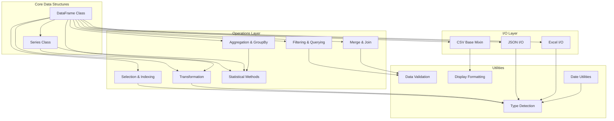
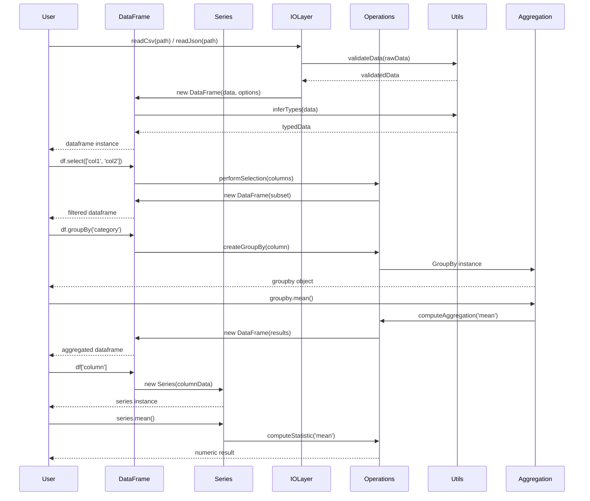

# Design Document: pandas-like-enhancements

## Overview

This design document outlines the comprehensive enhancement of the node-pandas library to transform it into a production-ready, pandas-like data manipulation library for Node.js. The enhancements focus on seven key areas: comprehensive JSDoc documentation, JavaScript best practices adherence, extensive test coverage, professional documentation with visual diagrams, package metadata improvements, expanded pandas-compatible API methods, and overall code quality improvements. The design maintains backward compatibility while significantly expanding functionality to cover the most commonly used pandas operations including data selection, filtering, aggregation, transformation, merging, and statistical analysis.

## Architecture

The enhanced node-pandas library follows a modular, object-oriented architecture with clear separation of concerns. The core data structures (Series and DataFrame) extend JavaScript's native Array class to provide familiar array-like behavior while adding pandas-specific functionality through mixins and prototype extensions.

## Main Algorithm/Workflow

## Correctness Properties

*A property is a characteristic or behavior that should hold true across all valid executions of a system—essentially, a formal statement about what the system should do. Properties serve as the bridge between human-readable specifications and machine-verifiable correctness guarantees.*

### Property 1: Series Creation Preserves Array Elements

*For any* valid one-dimensional array, creating a Series and accessing elements by their original indices should return the same values as the original array.

**Validates: Requirements 1.1**

### Property 2: DataFrame Creation Preserves Structure

*For any* valid two-dimensional array and column names array, creating a DataFrame should result in an object where the number of rows equals the outer array length, the number of columns equals the column names length, and accessing data by row and column indices returns the original values.

**Validates: Requirements 1.2**

### Property 3: Column Access Returns Series

*For any* DataFrame and any valid column name in that DataFrame, accessing the column should return a Series object containing exactly the values from that column in order.

**Validates: Requirements 1.3, 3.2**

### Property 4: DataFrame Properties Are Consistent

*For any* DataFrame, the length of the index array should equal the rows property, the length of the columns array should equal the cols property, and both should accurately reflect the data dimensions.

**Validates: Requirements 1.4**

### Property 5: Series Supports Standard Iteration

*For any* Series, iterating with for...of, forEach, or map should visit each element exactly once in index order, and the iteration should behave identically to iterating over a standard JavaScript array with the same elements.

**Validates: Requirements 1.6**

### Property 6: CSV Round-Trip Preserves Data

*For any* DataFrame, writing it to CSV with toCsv and then reading it back with readCsv should produce a DataFrame with equivalent structure and values (accounting for type coercion of numeric strings).

**Validates: Requirements 2.1, 2.3**

### Property 7: JSON Round-Trip Preserves Data

*For any* DataFrame, writing it to JSON and then reading it back with readJson should produce a DataFrame with equivalent structure, values, and types.

**Validates: Requirements 2.4**

### Property 8: Invalid Data Is Rejected

*For any* malformed or invalid data structure, attempting to create a DataFrame should result in a descriptive error rather than creating a corrupted DataFrame.

**Validates: Requirements 2.5**

### Property 9: Invalid File Paths Produce Errors

*For any* non-existent or inaccessible file path, calling readCsv or readJson should return a descriptive error message indicating the file could not be accessed.

**Validates: Requirements 2.7**

### Property 10: Column Selection Preserves Data

*For any* DataFrame and any subset of its column names, calling select should return a new DataFrame containing only those columns, with all row data preserved and in the same order.

**Validates: Requirements 3.1**

### Property 11: Row Access Returns Complete Row

*For any* DataFrame and any valid row index, accessing that row should return an object containing all column names as keys with their corresponding values from that row.

**Validates: Requirements 3.3**

### Property 12: Cell Access Returns Correct Value

*For any* DataFrame, valid row index, and valid column name, accessing the cell should return the exact value stored at that location.

**Validates: Requirements 3.4**

### Property 13: Invalid Column Access Produces Error

*For any* DataFrame and any column name not in that DataFrame's columns, attempting to access or select that column should return a descriptive error message.

**Validates: Requirements 3.5**

### Property 14: Subset Operations Preserve Types

*For any* DataFrame, selecting columns or rows should preserve the data types of all values in the resulting subset.

**Validates: Requirements 3.6**

### Property 15: Filter Returns Only Matching Rows

*For any* DataFrame and any filter condition, the filtered result should contain only rows where the condition evaluates to true, and should contain all such rows in their original order.

**Validates: Requirements 4.1**

### Property 16: Chained Filters Are Equivalent to Combined Condition

*For any* DataFrame and any two filter conditions A and B, applying filter A then filter B should produce the same result as applying a single filter with condition (A AND B).

**Validates: Requirements 4.2**

### Property 17: Invalid Filter Columns Produce Errors

*For any* DataFrame and any filter condition referencing a non-existent column, applying the filter should return a descriptive error message.

**Validates: Requirements 4.5**

### Property 18: GroupBy Returns Correct Object Type

*For any* DataFrame and any valid column name, calling groupBy should return a GroupBy object that supports aggregation methods.

**Validates: Requirements 5.1**

### Property 19: Aggregation Computes Correct Group Statistics

*For any* GroupBy object and any aggregation method (mean, sum, count, min, max), the result should be a DataFrame where each row represents one group and the aggregated value is correctly computed from only that group's rows.

**Validates: Requirements 5.2**

### Property 20: Aggregation Excludes Non-Numeric Values

*For any* DataFrame with mixed-type columns, aggregating numeric operations (mean, sum, std) should exclude non-numeric values and compute results using only numeric values.

**Validates: Requirements 5.4**

### Property 21: Multi-Column GroupBy Creates Hierarchical Groups

*For any* DataFrame and any array of column names, grouping by multiple columns should create groups where rows are grouped first by the first column, then by the second column within each first-level group, and so on.

**Validates: Requirements 5.5**

### Property 22: Series Transformation Preserves Length

*For any* Series and any transformation function, applying the transformation should return a new Series with the same length where each element is the result of applying the function to the corresponding original element.

**Validates: Requirements 6.1**

### Property 23: DataFrame Column Transformation Preserves Structure

*For any* DataFrame, column name, and transformation function, transforming that column should return a new DataFrame with the same dimensions where only the specified column's values are transformed.

**Validates: Requirements 6.2**

### Property 24: Transformation Errors Are Handled Gracefully

*For any* Series or DataFrame and any transformation function that throws an error on some input, the system should catch the error and return a descriptive error message indicating which value caused the failure.

**Validates: Requirements 6.4**

### Property 25: Transformed Values Have Inferred Types

*For any* Series or DataFrame column after transformation, the Type_System should correctly infer the data type of the resulting values based on their actual types.

**Validates: Requirements 6.5**

### Property 26: Statistical Methods Return Correct Values

*For any* Series containing numeric values, statistical methods (mean, median, std, var, min, max, sum) should return mathematically correct results computed from all numeric values.

**Validates: Requirements 7.1**

### Property 27: Statistics on Non-Numeric Data Produce Errors or Skip Values

*For any* Series containing non-numeric values, calling numeric statistical methods should either return an error message or automatically skip non-numeric values and compute results from numeric values only.

**Validates: Requirements 7.3**

### Property 28: Describe Returns Complete Statistical Summary

*For any* DataFrame, calling describe should return a DataFrame where each column represents a numeric column from the original, and each row represents a statistical measure (count, mean, std, min, max, etc.).

**Validates: Requirements 7.4**

### Property 29: Null Values Are Excluded from Statistics

*For any* Series or DataFrame containing null or undefined values, statistical calculations should exclude these values and compute results using only defined numeric values.

**Validates: Requirements 7.5**

### Property 30: Merge Combines DataFrames on Join Key

*For any* two DataFrames and a common join key column, merging should return a new DataFrame where each row represents a match between rows from both DataFrames based on equal join key values.

**Validates: Requirements 8.1**

### Property 31: Merge Adds Suffixes for Conflicting Columns

*For any* two DataFrames with overlapping column names (excluding the join key), merging should add suffixes to distinguish columns from each DataFrame in the result.

**Validates: Requirements 8.3**

### Property 32: Merge Validates Join Keys Exist

*For any* two DataFrames and a specified join key, if the join key does not exist in both DataFrames, the merge operation should return a descriptive error message.

**Validates: Requirements 8.4**

### Property 33: Join Types Handle Non-Matching Keys Correctly

*For any* two DataFrames with non-overlapping join key values, inner join should return an empty DataFrame, left join should return all left DataFrame rows, right join should return all right DataFrame rows, and outer join should return all rows from both.

**Validates: Requirements 8.5**

### Property 34: Concat Stacks DataFrames Correctly

*For any* array of DataFrames, concatenating vertically should stack them with rows from each DataFrame appearing in sequence, and concatenating horizontally should place them side-by-side with columns from each DataFrame.

**Validates: Requirements 8.6**

### Property 35: Show Produces Formatted Output

*For any* DataFrame or Series, accessing the show property should produce output that includes all data values in a structured tabular format.

**Validates: Requirements 9.1, 9.2**

### Property 36: Numeric Formatting Is Consistent

*For any* DataFrame or Series containing numeric values, the display formatting should represent numbers with consistent precision and formatting rules.

**Validates: Requirements 9.3**

### Property 37: Display Options Limit Output Size

*For any* large DataFrame, when display options specify a row limit, the show property should display at most that many rows.

**Validates: Requirements 9.5**

### Property 38: Type Inference Detects Correct Types

*For any* array of values, the Type_System should correctly identify whether each value is numeric, string, boolean, date, or null.

**Validates: Requirements 15.1, 15.2**

### Property 39: Type Validation Rejects Incompatible Operations

*For any* operation requiring specific types (e.g., numeric aggregation), attempting to perform it on incompatible types should return a descriptive error message indicating the type mismatch.

**Validates: Requirements 15.3, 15.4**

### Property 40: Type Coercion Handles Compatible Types

*For any* value that can be coerced to a compatible type (e.g., string "123" to number 123), the Type_System should perform the coercion when appropriate for the operation.

**Validates: Requirements 15.5, 15.6**

### Property 41: Backward Compatible API Methods Work

*For any* existing code using the original node-pandas API (Series creation, DataFrame creation, readCsv, toCsv, column access, index, columns, rows, cols, show), the enhanced system should produce the same results as the original implementation.

**Validates: Requirements 16.3**

### Property 42: Deprecated Features Produce Warnings

*For any* deprecated API usage, the system should continue to function correctly while logging a deprecation warning message.

**Validates: Requirements 16.4**

### Property 43: Error Objects Use Standard JavaScript Types

*For any* error condition, the system should throw or return standard JavaScript Error objects with appropriate error types (TypeError, RangeError, etc.).

**Validates: Requirements 18.5**

### Property 44: Warnings Are Logged for Problematic Usage

*For any* usage pattern that is valid but potentially problematic (e.g., deprecated features, performance concerns), the system should log a warning message to the console.

**Validates: Requirements 18.6**
