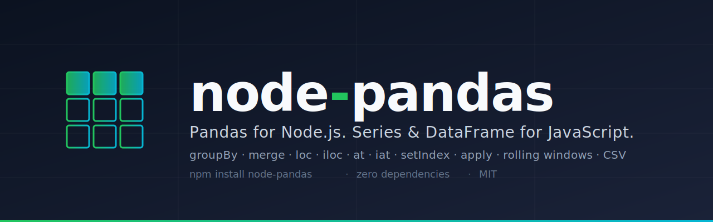

<p align="center">
  
</p>

# node-pandas

[](https://www.npmjs.com/package/node-pandas)
[](https://www.npmjs.com/package/node-pandas)
[](https://packagephobia.com/result?p=node-pandas)
[](./LICENSE)
[](https://github.com/hygull/node-pandas)

**Pandas for Node.js.** A pandas-like data manipulation library for JavaScript and Node.js. Provides `Series` and `DataFrame` data structures with `groupBy`, `merge`, `concat`, indexing (`loc`, `iloc`, `at`, `iat`), `setIndex` / `resetIndex`, `apply` with axis support, rolling and expanding window operations, string accessors, and CSV I/O. **Zero runtime dependencies.**

If you've used Python's [pandas](https://pandas.pydata.org/) and want the same API in Node.js, this library is for you.

```javascript
const pd = require("node-pandas")

const df = pd.DataFrame(
  [
    ['Subhash Agrawani', 'Eng', 95000],
    ['Sandhya Agrawani', 'Sales', 70000],
    ['Rishikesh Agrawani', 'Eng', 90000],
    ['Malinikesh Agrawani', 'Eng', 85000]
  ],
  ['name', 'team', 'salary']
)

const avgByTeam = df.groupBy('team').mean('salary')
avgByTeam.show
// ┌─────────┬───────┬─────────┐
// │ (index) │ team  │ salary  │
// ├─────────┼───────┼─────────┤
// │ 0       │ Eng   │ 90000   │
// │ 1       │ Sales │ 70000   │
// └─────────┴───────┴─────────┘
```

## Why node-pandas?

- **Zero runtime dependencies.** The whole library installs in seconds with no transitive bloat.
- **Pandas-faithful API.** Method names and behavior mirror Python pandas, so muscle memory transfers.
- **Real Series and DataFrame.** Both extend `Array`, so `df.length`, `for...of`, and indexing work natively.
- **Batteries included.** GroupBy with aggregations, merge with all join types, rolling/expanding windows, string accessors, label/position-based indexing, and CSV I/O — out of the box.

## pandas vs node-pandas

The same operation, side by side.

**Group by + aggregate:**

```python
# Python pandas
import pandas as pd

df = pd.DataFrame({
    'team': ['Eng', 'Sales', 'Eng'],
    'salary': [90000, 70000, 95000]
})
df.groupby('team').mean()
```

```javascript
// node-pandas
const pd = require("node-pandas")

const df = pd.DataFrame(
  [['Eng', 90000], ['Sales', 70000], ['Eng', 95000]],
  ['team', 'salary']
)
df.groupBy('team').mean('salary')
```

**Read CSV, filter, select:**

```python
# Python pandas
df = pd.read_csv('data.csv')
adults = df[df['age'] >= 18][['name', 'email']]
```

```javascript
// node-pandas
const df = pd.readCsv('./data.csv')
const adults = df.filter(row => row.age >= 18).select(['name', 'email'])
```

## Installation

| Use case | Command |
| --- | --- |
| Local install (default) | `npm install node-pandas` |
| Save as dev dependency | `npm install --save-dev node-pandas` |
| Global install | `npm install -g node-pandas` |
| Yarn | `yarn add node-pandas` |
| pnpm | `pnpm add node-pandas` |

Requires Node.js 14 or later. Works in Node and in browser bundlers (webpack, esbuild, Vite, etc.).

## Documentation

- **Full docs site:** [hygull.github.io/node-pandas](https://hygull.github.io/node-pandas/)
- **Changelog:** [CHANGELOG.md](./CHANGELOG.md)
- **Naming convention:** see the [Naming convention](#naming-convention) section below — camelCase canonical, snake_case supported as aliases.

> **Status:** Actively developed. New pandas methods are added with each release.

## At a glance — capabilities

| Category | Methods |
| --- | --- |
| **Data structures** | `Series`, `DataFrame`, `readCsv`, `toCsv`, `dateRange` |
| **Selection & filtering** | `select`, `filter`, column accessors (`df.colName`) |
| **Indexing** | `loc`, `iloc` (label/position, supports arrays), `at`, `iat` (single-cell, fast) |
| **Index manipulation** | `setIndex`, `resetIndex` |
| **Sorting** | `sortValues` / `sort_values`, `sortIndex` / `sort_index` |
| **Aggregation** | `groupBy().mean/sum/count/min/max/std`, `mean`, `median`, `mode`, `std`, `var`, `min`, `max`, `describe` |
| **Joins & concat** | `merge` (inner/left/right/outer), `concat` (axis 0/1) |
| **Apply / transform** | `apply(fn, { axis })` (DataFrame), `apply`/`map`/`replace` (Series) |
| **Missing data** | `fillna`, `dropna`, `isna`, `notna` |
| **Value operations** | `unique`, `valueCounts` / `value_counts`, `duplicated`, `dropDuplicates` / `drop_duplicates` |
| **Comparison** | `eq`, `ne`, `gt`, `lt`, `ge`, `le`, `between` |
| **Cumulative** | `cumsum`, `cumprod`, `cummax`, `cummin` |
| **Window** | `rolling(window).{mean,sum,min,max,std}`, `expanding().{mean,sum,min,max,std}` |
| **String accessor** | `str.upper`, `str.lower`, `str.contains`, `str.replace`, `str.split`, `str.strip`, `str.startswith`, `str.endswith`, `str.len` |

## Table of contents

> ### `Series`

1.  [Example 1 - Creating Series using 1D array/list](#s-ex1)

2.  [Series Methods](#series-methods)
    - [Sorting Methods](#sorting-methods) - sort_values(), sort_index()
    - [Missing Data Handling](#missing-data-handling) - fillna(), dropna(), isna(), notna()
    - [Value Operations](#value-operations) - unique(), value_counts(), duplicated(), drop_duplicates()
    - [Comparison Operations](#comparison-operations) - eq(), ne(), gt(), lt(), ge(), le(), between()
    - [Cumulative Operations](#cumulative-operations) - cumsum(), cumprod(), cummax(), cummin()
    - [String Methods](#string-methods) - str.upper(), str.lower(), str.contains(), str.replace(), str.split(), str.strip(), str.startswith(), str.endswith(), str.len()
    - [Indexing Methods](#indexing-methods) - loc.get(), loc.set(), iloc.get(), iloc.set()
    - [Window Operations](#window-operations) - rolling(), expanding()

> ### `DataFrame`

1.  [Example 1 - Creating DataFrame using 2D array/list](#df-ex1)

2.  [Example 2 - Creating DataFrame using a CSV file](#df-ex2)

3.  [Example 3 - Saving DataFrame in a CSV file](#df-ex3)

4.  [Example 4 - Accessing columns (Retrieving columns using column name)](#df-ex4) - `df.fullName -> ["R A", "B R", "P K"]`

5.  [Example 5 - Selecting specific columns using select()](#df-ex5)

6.  [Example 6 - Filtering DataFrame rows using filter()](#df-ex6)

7.  [Example 7 - Grouping and aggregating data using groupBy()](#df-ex7)

8.  [Example 8 - Merging DataFrames using merge()](#df-ex8)

9.  [Example 9 - Concatenating DataFrames using concat()](#df-ex9)

<hr>

## Naming convention

`node-pandas` uses **camelCase** as the canonical naming convention for all methods (e.g. `setIndex`, `sortValues`, `dropDuplicates`).

For backward compatibility, the four methods originally shipped with snake_case names continue to work:

| Canonical (camelCase) | Alias (snake_case) |
| --- | --- |
| `sortValues` | `sort_values` |
| `sortIndex` | `sort_index` |
| `valueCounts` | `value_counts` |
| `dropDuplicates` | `drop_duplicates` |

The aliases are literally the same function reference — there is no behavior or performance difference. New code should prefer the camelCase form.

## Getting started

### `Series`

<h4 id='s-ex1'>Example 1 — Creating a Series from a 1D array</h4>

```javascript
const pd = require("node-pandas")

const s = pd.Series([1, 9, 2, 6, 7, -8, 4, -3, 0, 5])
console.log(s)
// NodeSeries [ 1, 9, 2, 6, 7, -8, 4, -3, 0, 5 ]

s.show
// ┌─────────┬────────┐
// │ (index) │ Values │
// ├─────────┼────────┤
// │ 0       │ 1      │
// │ 1       │ 9      │
// │ 2       │ 2      │
// │ 3       │ 6      │
// │ 4       │ 7      │
// │ 5       │ -8     │
// │ 6       │ 4      │
// │ 7       │ -3     │
// │ 8       │ 0      │
// │ 9       │ 5      │
// └─────────┴────────┘

console.log(s[0])       // 1   — first element
console.log(s.length)   // 10  — total number of elements
```

## Series Methods

### Sorting Methods

#### sort_values()

Sorts Series values in ascending or descending order.

```javascript
const pd = require("node-pandas")

const s = pd.Series([5, 2, 8, 1, 9], { name: 'numbers' })
console.log(s)
// NodeSeries [ 5, 2, 8, 1, 9 ]

// Sort in ascending order (default)
const sorted_asc = s.sort_values()
console.log(sorted_asc)
// NodeSeries [ 1, 2, 5, 8, 9 ]

// Sort in descending order
const sorted_desc = s.sort_values(false)
console.log(sorted_desc)
// NodeSeries [ 9, 8, 5, 2, 1 ]
```

#### sort_index()

Sorts Series by index labels in ascending or descending order.

```javascript
const pd = require("node-pandas")

const s = pd.Series([10, 20, 30], { index: ['c', 'a', 'b'], name: 'values' })
console.log(s)
// NodeSeries [ 10, 20, 30 ]
// index: ['c', 'a', 'b']

// Sort by index in ascending order
const sorted_asc = s.sort_index()
console.log(sorted_asc)
// NodeSeries [ 20, 30, 10 ]
// index: ['a', 'b', 'c']

// Sort by index in descending order
const sorted_desc = s.sort_index(false)
console.log(sorted_desc)
// NodeSeries [ 10, 30, 20 ]
// index: ['c', 'b', 'a']
```

### Missing Data Handling

#### fillna()

Fills missing values (null, undefined, NaN) with a specified value.

```javascript
const pd = require("node-pandas")

const s = pd.Series([1, null, 3, NaN, 5, undefined])
console.log(s)
// NodeSeries [ 1, null, 3, NaN, 5, undefined ]

// Fill missing values with 0
const filled = s.fillna(0)
console.log(filled)
// NodeSeries [ 1, 0, 3, 0, 5, 0 ]
```

#### dropna()

Removes all missing values (null, undefined, NaN) from the Series.

```javascript
const pd = require("node-pandas")

const s = pd.Series([1, null, 3, NaN, 5, undefined])
console.log(s)
// NodeSeries [ 1, null, 3, NaN, 5, undefined ]

// Drop missing values
const cleaned = s.dropna()
console.log(cleaned)
// NodeSeries [ 1, 3, 5 ]
```

#### isna()

Returns a boolean Series indicating which values are missing (null, undefined, NaN).

```javascript
const pd = require("node-pandas")

const s = pd.Series([1, null, 3, NaN, 5])
console.log(s)
// NodeSeries [ 1, null, 3, NaN, 5 ]

// Check for missing values
const missing = s.isna()
console.log(missing)
// NodeSeries [ false, true, false, true, false ]
```

#### notna()

Returns a boolean Series indicating which values are not missing.

```javascript
const pd = require("node-pandas")

const s = pd.Series([1, null, 3, NaN, 5])
console.log(s)
// NodeSeries [ 1, null, 3, NaN, 5 ]

// Check for non-missing values
const notMissing = s.notna()
console.log(notMissing)
// NodeSeries [ true, false, true, false, true ]
```

### Value Operations

#### unique()

Returns a new Series with unique values, preserving order of first appearance.

```javascript
const pd = require("node-pandas")

const s = pd.Series([1, 2, 2, 3, 1, 4, 3, 5])
console.log(s)
// NodeSeries [ 1, 2, 2, 3, 1, 4, 3, 5 ]

// Get unique values
const uniqueValues = s.unique()
console.log(uniqueValues)
// NodeSeries [ 1, 2, 3, 4, 5 ]
```

#### value_counts()

Returns a Series containing counts of unique values, sorted by frequency in descending order.

```javascript
const pd = require("node-pandas")

const s = pd.Series(['apple', 'banana', 'apple', 'orange', 'banana', 'apple'])
console.log(s)
// NodeSeries [ 'apple', 'banana', 'apple', 'orange', 'banana', 'apple' ]

// Count occurrences of each value
const counts = s.value_counts()
counts.show
/*
┌─────────┬──────────┬────────┐
│ (index) │ value    │ count  │
├─────────┼──────────┼────────┤
│ 0       │ 'apple'  │ 3      │
│ 1       │ 'banana' │ 2      │
│ 2       │ 'orange' │ 1      │
└─────────┴──────────┴────────┘
*/
```

#### duplicated()

Returns a boolean Series indicating duplicate values. The `keep` parameter controls which duplicates are marked:
- `'first'` (default): Mark duplicates as true except for the first occurrence
- `'last'`: Mark duplicates as true except for the last occurrence
- `false`: Mark all duplicates as true

```javascript
const pd = require("node-pandas")

const s = pd.Series([1, 2, 2, 3, 1, 4])
console.log(s)
// NodeSeries [ 1, 2, 2, 3, 1, 4 ]

// Mark duplicates (keep first occurrence)
const isDup = s.duplicated('first')
console.log(isDup)
// NodeSeries [ false, false, true, false, true, false ]

// Mark duplicates (keep last occurrence)
const isDupLast = s.duplicated('last')
console.log(isDupLast)
// NodeSeries [ true, false, true, false, false, false ]

// Mark all duplicates
const isDupAll = s.duplicated(false)
console.log(isDupAll)
// NodeSeries [ true, true, true, false, true, false ]
```

#### drop_duplicates()

Returns a new Series with duplicate values removed. The `keep` parameter controls which duplicates to keep:
- `'first'` (default): Keep the first occurrence
- `'last'`: Keep the last occurrence
- `false`: Remove all duplicates

```javascript
const pd = require("node-pandas")

const s = pd.Series([1, 2, 2, 3, 1, 4])
console.log(s)
// NodeSeries [ 1, 2, 2, 3, 1, 4 ]

// Keep first occurrence of duplicates
const uniqueFirst = s.drop_duplicates('first')
console.log(uniqueFirst)
// NodeSeries [ 1, 2, 3, 4 ]

// Keep last occurrence of duplicates
const uniqueLast = s.drop_duplicates('last')
console.log(uniqueLast)
// NodeSeries [ 2, 3, 1, 4 ]

// Remove all duplicates
const noDuplicates = s.drop_duplicates(false)
console.log(noDuplicates)
// NodeSeries [ 3, 4 ]
```

### Comparison Operations

#### eq()

Element-wise equality comparison. Compares Series values with a scalar or another Series.

```javascript
const pd = require("node-pandas")

const s = pd.Series([1, 2, 3, 4, 5])
const result = s.eq(3)
console.log(result)
// NodeSeries [ false, false, true, false, false ]

// Compare with another Series
const s1 = pd.Series([1, 2, 3])
const s2 = pd.Series([1, 0, 3])
const result2 = s1.eq(s2)
console.log(result2)
// NodeSeries [ true, false, true ]
```

#### ne()

Element-wise not-equal comparison.

```javascript
const pd = require("node-pandas")

const s = pd.Series([1, 2, 3, 4, 5])
const result = s.ne(3)
console.log(result)
// NodeSeries [ true, true, false, true, true ]
```

#### gt()

Element-wise greater-than comparison.

```javascript
const pd = require("node-pandas")

const s = pd.Series([1, 2, 3, 4, 5])
const result = s.gt(3)
console.log(result)
// NodeSeries [ false, false, false, true, true ]
```

#### lt()

Element-wise less-than comparison.

```javascript
const pd = require("node-pandas")

const s = pd.Series([1, 2, 3, 4, 5])
const result = s.lt(3)
console.log(result)
// NodeSeries [ true, true, false, false, false ]
```

#### ge()

Element-wise greater-than-or-equal comparison.

```javascript
const pd = require("node-pandas")

const s = pd.Series([1, 2, 3, 4, 5])
const result = s.ge(3)
console.log(result)
// NodeSeries [ false, false, true, true, true ]
```

#### le()

Element-wise less-than-or-equal comparison.

```javascript
const pd = require("node-pandas")

const s = pd.Series([1, 2, 3, 4, 5])
const result = s.le(3)
console.log(result)
// NodeSeries [ true, true, true, false, false ]
```

#### between()

Check if values fall within a specified range. The `inclusive` parameter controls boundary inclusion:
- `'both'` (default): Include both boundaries
- `'neither'`: Exclude both boundaries
- `'left'`: Include left boundary only
- `'right'`: Include right boundary only

```javascript
const pd = require("node-pandas")

const s = pd.Series([1, 2, 3, 4, 5])
const result = s.between(2, 4)
console.log(result)
// NodeSeries [ false, true, true, true, false ]

// Exclude boundaries
const result2 = s.between(2, 4, 'neither')
console.log(result2)
// NodeSeries [ false, false, true, false, false ]
```

### Cumulative Operations

#### cumsum()

Returns cumulative sum of values. Null values are preserved and skip accumulation.

```javascript
const pd = require("node-pandas")

const s = pd.Series([1, 2, 3, 4, 5])
const result = s.cumsum()
console.log(result)
// NodeSeries [ 1, 3, 6, 10, 15 ]

// With null values
const s2 = pd.Series([1, null, 3, 4, null, 6])
const result2 = s2.cumsum()
console.log(result2)
// NodeSeries [ 1, null, 4, 8, null, 14 ]
```

#### cumprod()

Returns cumulative product of values. Null values are preserved and skip accumulation.

```javascript
const pd = require("node-pandas")

const s = pd.Series([1, 2, 3, 4, 5])
const result = s.cumprod()
console.log(result)
// NodeSeries [ 1, 2, 6, 24, 120 ]

// With zeros
const s2 = pd.Series([1, 2, 0, 4, 5])
const result2 = s2.cumprod()
console.log(result2)
// NodeSeries [ 1, 2, 0, 0, 0 ]
```

#### cummax()

Returns cumulative maximum of values. Null values are preserved and skip accumulation.

```javascript
const pd = require("node-pandas")

const s = pd.Series([3, 1, 4, 1, 5, 9, 2])
const result = s.cummax()
console.log(result)
// NodeSeries [ 3, 3, 4, 4, 5, 9, 9 ]

// With negative numbers
const s2 = pd.Series([-5, -2, -8, -1, -3])
const result2 = s2.cummax()
console.log(result2)
// NodeSeries [ -5, -2, -2, -1, -1 ]
```

#### cummin()

Returns cumulative minimum of values. Null values are preserved and skip accumulation.

```javascript
const pd = require("node-pandas")

const s = pd.Series([3, 1, 4, 1, 5, 9, 2])
const result = s.cummin()
console.log(result)
// NodeSeries [ 3, 1, 1, 1, 1, 1, 1 ]

// With negative numbers
const s2 = pd.Series([-5, -2, -8, -1, -3])
const result2 = s2.cummin()
console.log(result2)
// NodeSeries [ -5, -5, -8, -8, -8 ]
```

### String Methods

The `str` accessor provides string manipulation methods that work element-wise on Series values. All methods preserve null values.

#### str.upper()

Convert strings to uppercase.

```javascript
const pd = require("node-pandas")

const s = pd.Series(['hello', 'world', null])
const result = s.str.upper()
console.log(result)
// NodeSeries [ 'HELLO', 'WORLD', null ]
```

#### str.lower()

Convert strings to lowercase.

```javascript
const pd = require("node-pandas")

const s = pd.Series(['HELLO', 'WORLD', null])
const result = s.str.lower()
console.log(result)
// NodeSeries [ 'hello', 'world', null ]
```

#### str.contains()

Check if strings contain a substring. Optional case-insensitive matching.

```javascript
const pd = require("node-pandas")

const s = pd.Series(['hello', 'world', null, 'HELLO'])
const result = s.str.contains('ell')
console.log(result)
// NodeSeries [ true, false, null, false ]

// Case-insensitive
const result2 = s.str.contains('ell', false)
console.log(result2)
// NodeSeries [ true, false, null, true ]
```

#### str.replace()

Replace occurrences of pattern with replacement string. Supports regex patterns.

```javascript
const pd = require("node-pandas")

const s = pd.Series(['hello world', 'hello there', null])
const result = s.str.replace('hello', 'hi')
console.log(result)
// NodeSeries [ 'hi world', 'hi there', null ]
```

#### str.split()

Split strings by separator and return arrays.

```javascript
const pd = require("node-pandas")

const s = pd.Series(['a,b,c', 'd,e,f', null])
const result = s.str.split(',')
console.log(result)
// NodeSeries [ ['a','b','c'], ['d','e','f'], null ]
```

#### str.strip()

Remove leading and trailing whitespace.

```javascript
const pd = require("node-pandas")

const s = pd.Series(['  hello  ', '  world', null, 'test  '])
const result = s.str.strip()
console.log(result)
// NodeSeries [ 'hello', 'world', null, 'test' ]
```

#### str.startswith()

Check if strings start with a prefix.

```javascript
const pd = require("node-pandas")

const s = pd.Series(['hello', 'world', null, 'help'])
const result = s.str.startswith('hel')
console.log(result)
// NodeSeries [ true, false, null, true ]
```

#### str.endswith()

Check if strings end with a suffix.

```javascript
const pd = require("node-pandas")

const s = pd.Series(['hello', 'world', null, 'test'])
const result = s.str.endswith('ld')
console.log(result)
// NodeSeries [ false, true, null, false ]
```

#### str.len()

Get the length of each string.

```javascript
const pd = require("node-pandas")

const s = pd.Series(['hello', 'world', null, 'test'])
const result = s.str.len()
console.log(result)
// NodeSeries [ 5, 5, null, 4 ]
```

### Indexing Methods

The `loc` and `iloc` accessors provide label-based and position-based indexing for Series data.

#### loc.get()

Access values by index labels. Supports single labels and arrays of labels.

```javascript
const pd = require("node-pandas")

const s = pd.Series([10, 20, 30, 40], { index: ['a', 'b', 'c', 'd'] })
console.log(s)
// NodeSeries [ 10, 20, 30, 40 ]
// index: ['a', 'b', 'c', 'd']

// Get single value by label
const value = s.loc.get('b')
console.log(value)
// 20

// Get multiple values by labels
const values = s.loc.get(['a', 'c', 'd'])
console.log(values)
// NodeSeries [ 10, 30, 40 ]
// index: ['a', 'c', 'd']
```

#### iloc.get()

Access values by integer positions. Supports single positions and arrays of positions.

```javascript
const pd = require("node-pandas")

const s = pd.Series([10, 20, 30, 40], { index: ['a', 'b', 'c', 'd'] })
console.log(s)
// NodeSeries [ 10, 20, 30, 40 ]

// Get single value by position
const value = s.iloc.get(1)
console.log(value)
// 20

// Get multiple values by positions
const values = s.iloc.get([0, 2, 3])
console.log(values)
// NodeSeries [ 10, 30, 40 ]
```

#### loc.set()

Set values by index labels. Supports single labels and arrays of labels.

```javascript
const pd = require("node-pandas")

const s = pd.Series([10, 20, 30, 40], { index: ['a', 'b', 'c', 'd'] })

// Set single value by label
s.loc.set('b', 99)
console.log(s)
// NodeSeries [ 10, 99, 30, 40 ]

// Set multiple values by labels
s.loc.set(['a', 'c'], [100, 300])
console.log(s)
// NodeSeries [ 100, 99, 300, 40 ]
```

#### iloc.set()

Set values by integer positions. Supports single positions and arrays of positions.

```javascript
const pd = require("node-pandas")

const s = pd.Series([10, 20, 30, 40], { index: ['a', 'b', 'c', 'd'] })

// Set single value by position
s.iloc.set(1, 99)
console.log(s)
// NodeSeries [ 10, 99, 30, 40 ]

// Set multiple values by positions
s.iloc.set([0, 2], [100, 300])
console.log(s)
// NodeSeries [ 100, 99, 300, 40 ]
```

#### at.get() / at.set()

Fast scalar label-based accessor. Like `loc`, but accepts only a single scalar label (no arrays or slices). Use this when you know you want exactly one cell.

```javascript
const pd = require("node-pandas")

const s = pd.Series([10, 20, 30], { index: ['a', 'b', 'c'] })

// Get single value by label
console.log(s.at.get('b'))
// 20

// Set single value by label (mutates in place, returns the Series for chaining)
s.at.set('b', 99)
console.log(s.at.get('b'))
// 99

// Errors:
//   s.at.get(['a', 'b'])  // throws ValidationError (arrays not allowed)
//   s.at.get('z')         // throws IndexError (label not in index)
```

#### iat.get() / iat.set()

Fast scalar position-based accessor. Like `iloc`, but accepts only a single integer position. Use this when you know you want exactly one cell.

```javascript
const pd = require("node-pandas")

const s = pd.Series([10, 20, 30], { index: ['a', 'b', 'c'] })

// Get value by position
console.log(s.iat.get(1))
// 20

// Set value by position (mutates in place, returns the Series)
s.iat.set(1, 99)
console.log(s.iat.get(1))
// 99

// Errors:
//   s.iat.get([0])    // throws ValidationError (arrays not allowed)
//   s.iat.get(1.5)    // throws ValidationError (must be integer)
//   s.iat.get(99)     // throws IndexError (out of range)
```

`at` and `iat` also work on DataFrames as `df.at.get(rowLabel, colName)` and `df.iat.get(rowPos, colPos)`. See the DataFrame Methods section below.

### Window Operations

Window operations allow you to perform calculations over sliding or expanding windows of data.

#### rolling()

Create a rolling window for calculating statistics over a fixed window size.

```javascript
const pd = require("node-pandas")

const s = pd.Series([1, 2, 3, 4, 5, 6, 7, 8, 9, 10])

// Rolling mean with window size 3
const rollingMean = s.rolling(3).mean()
console.log(rollingMean)
// NodeSeries [ null, null, 2, 3, 4, 5, 6, 7, 8, 9 ]

// Rolling sum with window size 3
const rollingSum = s.rolling(3).sum()
console.log(rollingSum)
// NodeSeries [ null, null, 6, 9, 12, 15, 18, 21, 24, 27 ]

// Rolling min with window size 3
const rollingMin = s.rolling(3).min()
console.log(rollingMin)
// NodeSeries [ null, null, 1, 2, 3, 4, 5, 6, 7, 8 ]

// Rolling max with window size 3
const rollingMax = s.rolling(3).max()
console.log(rollingMax)
// NodeSeries [ null, null, 3, 4, 5, 6, 7, 8, 9, 10 ]

// Rolling standard deviation with window size 3
const rollingStd = s.rolling(3).std()
console.log(rollingStd)
// NodeSeries [ null, null, 1, 1, 1, 1, 1, 1, 1, 1 ]
```

#### expanding()

Create an expanding window that includes all values from the start up to the current position.

```javascript
const pd = require("node-pandas")

const s = pd.Series([1, 2, 3, 4, 5])

// Expanding mean
const expandingMean = s.expanding().mean()
console.log(expandingMean)
// NodeSeries [ 1, 1.5, 2, 2.5, 3 ]

// Expanding sum
const expandingSum = s.expanding().sum()
console.log(expandingSum)
// NodeSeries [ 1, 3, 6, 10, 15 ]

// Expanding min
const expandingMin = s.expanding().min()
console.log(expandingMin)
// NodeSeries [ 1, 1, 1, 1, 1 ]

// Expanding max
const expandingMax = s.expanding().max()
console.log(expandingMax)
// NodeSeries [ 1, 2, 3, 4, 5 ]

// Expanding standard deviation
const expandingStd = s.expanding().std()
console.log(expandingStd)
// NodeSeries [ 0, 0.707..., 1, 1.29..., 1.58... ]
```

## DataFrame Methods

### Index Manipulation

#### setIndex()

Promote a column to be the DataFrame's row index. Returns a **new** DataFrame; the original is unchanged.

```javascript
const pd = require("node-pandas")

const df = pd.DataFrame(
  [[1, 'Malinikesh Agrawani', 28], [2, 'Hemkesh Agrawani', 30], [3, 'Rishikesh Agrawani', 32]],
  ['id', 'name', 'age']
)

// Promote 'id' to index (default: drop the column)
const indexed = df.setIndex('id')
console.log(indexed.index)
// [ 1, 2, 3 ]
console.log(indexed.columns)
// [ 'name', 'age' ]

// Keep the column as a regular column too
const kept = df.setIndex('id', { drop: false })
console.log(kept.columns)
// [ 'id', 'name', 'age' ]

// Errors:
//   df.setIndex('missing')   // throws ColumnError
//   df.setIndex(42)          // throws ValidationError
```

#### resetIndex()

Demote the current index back to a regular column, or discard it. Returns a **new** DataFrame.

```javascript
const pd = require("node-pandas")

const df = pd.DataFrame([[28, 'Malinikesh Agrawani'], [30, 'Hemkesh Agrawani']], ['age', 'name'])
df.index = ['a', 'b']

// Default: promote index to a column named 'index', reset index to 0..n-1
const a = df.resetIndex()
console.log(a.columns)
// [ 'index', 'age', 'name' ]
console.log(a.getRow(0))
// { index: 'a', age: 28, name: 'Malinikesh Agrawani' }

// Custom column name
const b = df.resetIndex({ name: 'label' })
console.log(b.columns)
// [ 'label', 'age', 'name' ]

// Discard the index entirely
const c = df.resetIndex({ drop: true })
console.log(c.columns)
// [ 'age', 'name' ]
console.log(c.index)
// [ 0, 1 ]
```

### Cell Accessors

#### at.get() / at.set()

Fast scalar label-based cell accessor. Accepts a single row label and a single column name.

```javascript
const pd = require("node-pandas")

const df = pd.DataFrame([[1, 'Malinikesh Agrawani', 28], [2, 'Hemkesh Agrawani', 30]], ['id', 'name', 'age'])
df.index = ['x', 'y']

// Get a single cell
console.log(df.at.get('x', 'name'))
// 'Malinikesh Agrawani'

// Set a single cell (mutates in place, returns the DataFrame)
df.at.set('x', 'name', 'Malini Agrawani')
console.log(df.at.get('x', 'name'))
// 'Malini Agrawani'

// Errors:
//   df.at.get('z', 'name')         // throws IndexError (row label not found)
//   df.at.get('x', 'missing')      // throws ColumnError
//   df.at.get(['x'], 'name')       // throws ValidationError (arrays not allowed)
```

#### iat.get() / iat.set()

Fast scalar position-based cell accessor. Accepts a row position and column position.

```javascript
const pd = require("node-pandas")

const df = pd.DataFrame([[1, 'Malinikesh Agrawani', 28], [2, 'Hemkesh Agrawani', 30]], ['id', 'name', 'age'])

// Get cell at (row 0, column 1)
console.log(df.iat.get(0, 1))
// 'Malinikesh Agrawani'

// Set cell (mutates, returns DataFrame)
df.iat.set(0, 1, 'Malini Agrawani')
console.log(df.iat.get(0, 1))
// 'Malini Agrawani'

// Errors:
//   df.iat.get(99, 0)        // throws IndexError (row out of range)
//   df.iat.get(0, 9)         // throws IndexError (column out of range)
//   df.iat.get(0.5, 0)       // throws ValidationError (must be integer)
```

### Apply with Axis

#### apply(fn, { axis })

Apply a function along an axis. The callback receives a real `Series` (with `_index` and `_name`), so you can compose with any Series method inside `fn`.

```javascript
const pd = require("node-pandas")

const df = pd.DataFrame(
  [[1, 10, 100], [2, 20, 200], [3, 30, 300]],
  ['a', 'b', 'c']
)

// axis: 0 (default) — apply per column, fn receives a Series per column
const colSums = df.apply(col => col._data.reduce((s, v) => s + v, 0))
console.log(colSums._data)
// [ 6, 60, 600 ]
console.log(colSums._index)
// [ 'a', 'b', 'c' ]   (indexed by column name)

// axis: 1 — apply per row, fn receives a Series per row
const rowSums = df.apply(row => row._data.reduce((s, v) => s + v, 0), { axis: 1 })
console.log(rowSums._data)
// [ 111, 222, 333 ]

// Returning arrays produces a DataFrame, with column names preserved on axis 0
const firstAndLast = df.apply(col => [col._data[0], col._data[col._data.length - 1]])
console.log(firstAndLast.columns)
// [ 'a', 'b', 'c' ]
console.log(firstAndLast.getRow(0))
// { a: 1, b: 10, c: 100 }

// Errors:
//   df.apply(null)                // throws ValidationError (fn must be a function)
//   df.apply(x => x, { axis: 2 }) // throws ValidationError (axis must be 0 or 1)
//   df.apply(() => i++ === 0 ? 1 : [1, 2])  // throws OperationError (mixed return shapes)
```

> **Note:** The legacy column-transform form `df.apply('columnName', fn)` — where `fn` transforms each cell of a single column — is still supported. The dispatcher routes by the type of the first argument: string → legacy column transform; function → axis-based apply.

<hr>

### `DataFrame`

<h4 id='df-ex1'>Example 1 — Creating a DataFrame from a 2D array</h4>

```javascript
const pd = require("node-pandas")

const columns = ['full_name', 'user_id', 'technology']
const df = pd.DataFrame([
  ['Guido Van Rossum', 6, 'Python'],
  ['Ryan Dahl', 5, 'Node.js'],
  ['Anders Hezlsberg', 7, 'TypeScript'],
  ['Wes McKinney', 3, 'Pandas'],
  ['Ken Thompson', 1, 'B language']
], columns)

df.show
// ┌─────────┬────────────────────┬─────────┬──────────────┐
// │ (index) │ full_name          │ user_id │ technology   │
// ├─────────┼────────────────────┼─────────┼──────────────┤
// │ 0       │ 'Guido Van Rossum' │ 6       │ 'Python'     │
// │ 1       │ 'Ryan Dahl'        │ 5       │ 'Node.js'    │
// │ 2       │ 'Anders Hezlsberg' │ 7       │ 'TypeScript' │
// │ 3       │ 'Wes McKinney'     │ 3       │ 'Pandas'     │
// │ 4       │ 'Ken Thompson'     │ 1       │ 'B language' │
// └─────────┴────────────────────┴─────────┴──────────────┘

console.log(df.index)    // [ 0, 1, 2, 3, 4 ]
console.log(df.columns)  // [ 'full_name', 'user_id', 'technology' ]
```

<h3 id='df-ex2'><code>Example 2 - Creating DataFrame using a CSV file</code></h3>

**Signature:** `pd.readCsv(csvPath)` — `csvPath` is the absolute or relative path to the CSV file. Multiple blank lines between rows are tolerated and collapsed to a single newline.

Source CSV — [`devs.csv`](https://github.com/hygull/node-pandas/blob/master/docs/csvs/devs.csv):

```csv
fullName,Profession,Language,DevId
Ken Thompson,C developer,C,1122
Ron Wilson,Ruby developer,Ruby,4433
Jeff Thomas,Java developer,Java,8899


Rishikesh Agrawani,Python developer,Python,6677
Kylie Dwine,C++,C++ Developer,0011

Briella Brown,JavaScript developer,JavaScript,8844
```

```javascript
const pd = require("node-pandas")

const df = pd.readCsv("./docs/csvs/devs.csv")

console.log(df.index)    // [ 0, 1, 2, 3, 4, 5 ]
console.log(df.columns)  // [ 'fullName', 'Profession', 'Language', 'DevId' ]

df.show
// ┌─────────┬──────────────────────┬────────────────────────┬─────────────────┬───────┐
// │ (index) │ fullName             │ Profession             │ Language        │ DevId │
// ├─────────┼──────────────────────┼────────────────────────┼─────────────────┼───────┤
// │ 0       │ 'Ken Thompson'       │ 'C developer'          │ 'C'             │ 1122  │
// │ 1       │ 'Ron Wilson'         │ 'Ruby developer'       │ 'Ruby'          │ 4433  │
// │ 2       │ 'Jeff Thomas'        │ 'Java developer'       │ 'Java'          │ 8899  │
// │ 3       │ 'Rishikesh Agrawani' │ 'Python developer'     │ 'Python'        │ 6677  │
// │ 4       │ 'Kylie Dwine'        │ 'C++'                  │ 'C++ Developer' │ 11    │
// │ 5       │ 'Briella Brown'      │ 'JavaScript developer' │ 'JavaScript'    │ 8844  │
// └─────────┴──────────────────────┴────────────────────────┴─────────────────┴───────┘

// Cell access by row index + column name
console.log(df[0]['fullName'])    // 'Ken Thompson'
console.log(df[3]['Profession'])  // 'Python developer'
console.log(df[5]['Language'])    // 'JavaScript'
```

<h4 id='df-ex3'>Example 3 — Saving a DataFrame to a CSV file</h4>

The `toCsv(path)` method writes the DataFrame to disk. The output path can be absolute or relative.

```javascript
const pd = require("node-pandas")

const df = pd.readCsv("./docs/csvs/devs.csv")

console.log(df.cols)     // 4
console.log(df.rows)     // 6
console.log(df.columns)  // [ 'fullName', 'Profession', 'Language', 'DevId' ]
console.log(df.index)    // [ 0, 1, 2, 3, 4, 5 ]

df.toCsv("./newDevs.csv")
// Writes the DataFrame to ./newDevs.csv
```

The resulting `newDevs.csv` (multiple blank lines from the source are collapsed):

```csv
fullName,Profession,Language,DevId
Ken Thompson,C developer,C,1122
Ron Wilson,Ruby developer,Ruby,4433
Jeff Thomas,Java developer,Java,8899
Rishikesh Agrawani,Python developer,Python,6677
Kylie Dwine,C++,C++ Developer,11
Briella Brown,JavaScript developer,JavaScript,8844
```

<hr>

<h3 id='df-ex4'><code>Example 4 - Accessing columns (Retrieving columns using column name)</code></h3>

> **CSV file** (devs.csv): [./docs/csvs/devs.csv](./docs/csvs/devs.csv)

```javascript
const pd = require("node-pandas")
df = pd.readCsv("./docs/csvs/devs.csv") // Node DataFrame object

df.show // View DataFrame in tabular form
/*
┌─────────┬──────────────────────┬────────────────────────┬─────────────────┬───────┐
│ (index) │ fullName             │ Profession             │ Language        │ DevId │
├─────────┼──────────────────────┼────────────────────────┼─────────────────┼───────┤
│ 0       │ 'Ken Thompson'       │ 'C developer'          │ 'C'             │ 1122  │
│ 1       │ 'Ron Wilson'         │ 'Ruby developer'       │ 'Ruby'          │ 4433  │
│ 2       │ 'Jeff Thomas'        │ 'Java developer'       │ 'Java'          │ 8899  │
│ 3       │ 'Rishikesh Agrawani' │ 'Python developer'     │ 'Python'        │ 6677  │
│ 4       │ 'Kylie Dwine'        │ 'C++'                  │ 'C++ Developer' │ 11    │
│ 5       │ 'Briella Brown'      │ 'JavaScirpt developer' │ 'JavaScript'    │ 8844  │
└─────────┴──────────────────────┴────────────────────────┴─────────────────┴───────┘
*/

console.log(df['fullName'])
/*
    NodeSeries [
      'Ken Thompson',
      'Ron Wilson',
      'Jeff Thomas',
      'Rishikesh Agrawani',
      'Kylie Dwine',
      'Briella Brown'
    ]
*/

console.log(df.DevId)
/* 
    NodeSeries [ 1122, 4433, 8899, 6677, 11, 8844 ]
*/

let languages = df.Language
console.log(languages) 
/*
    NodeSeries [
      'C',
      'Ruby',
      'Java',
      'Python',
      'C++ Developer',
      'JavaScript'
    ]
*/

console.log(languages[0], '&', languages[1]) // C & Ruby


let professions = df.Profession
console.log(professions) 
/*
    NodeSeries [
      'C developer',
      'Ruby developer',
      'Java developer',
      'Python developer',
      'C++',
      'JavaScirpt developer'
    ]
*/

// Iterate like arrays
for(let profession of professions) {
    console.log(profession)
}
/*
    C developer
    Ruby developer
    Java developer
    Python developer
    C++
    JavaScirpt developer
*/
```

<hr>

<h3 id='df-ex5'><code>Example 5 - Selecting specific columns using select()</code></h3>

> **Note:** The `select()` method returns a new DataFrame containing only the specified columns.

```javascript
const pd = require("node-pandas")

// Create a DataFrame with employee data
const df = pd.DataFrame([
    ['Rishikesh Agrawani', 32, 'Engineering'],
    ['Hemkesh Agrawani', 30, 'Marketing'],
    ['Malinikesh Agrawani', 28, 'Sales']
], ['name', 'age', 'department'])

df.show
/*
┌─────────┬──────────────────────┬─────┬──────────────┐
│ (index) │ name                 │ age │ department   │
├─────────┼──────────────────────┼─────┼──────────────┤
│ 0       │ 'Rishikesh Agrawani' │ 32  │ 'Engineering'│
│ 1       │ 'Hemkesh Agrawani'   │ 30  │ 'Marketing'  │
│ 2       │ 'Malinikesh Agrawani'│ 28  │ 'Sales'      │
└─────────┴──────────────────────┴─────┴──────────────┘
*/

// Select a single column
const nameOnly = df.select(['name'])
nameOnly.show
/*
┌─────────┬──────────────────────┐
│ (index) │ name                 │
├─────────┼──────────────────────┤
│ 0       │ 'Rishikesh Agrawani' │
│ 1       │ 'Hemkesh Agrawani'   │
│ 2       │ 'Malinikesh Agrawani'│
└─────────┴──────────────────────┘
*/

// Select multiple columns
const nameAndAge = df.select(['name', 'age'])
nameAndAge.show
/*
┌─────────┬──────────────────────┬─────┐
│ (index) │ name                 │ age │
├─────────┼──────────────────────┼─────┤
│ 0       │ 'Rishikesh Agrawani' │ 32  │
│ 1       │ 'Hemkesh Agrawani'   │ 30  │
│ 2       │ 'Malinikesh Agrawani'│ 28  │
└─────────┴──────────────────────┴─────┘
*/

// Original DataFrame remains unchanged
console.log(df.columns) // ['name', 'age', 'department']
```

<hr>

<h3 id='df-ex6'><code>Example 6 - Filtering DataFrame rows using filter()</code></h3>

> **Note:** The `filter()` method returns a new DataFrame containing only rows that match the condition. Multiple filters can be chained together.

```javascript
const pd = require("node-pandas")

// Create a DataFrame with employee data
const df = pd.DataFrame([
    ['Rishikesh Agrawani', 32, 'Engineering'],
    ['Hemkesh Agrawani', 30, 'Marketing'],
    ['Malinikesh Agrawani', 28, 'Sales']
], ['name', 'age', 'department'])

df.show
/*
┌─────────┬──────────────────────┬─────┬──────────────┐
│ (index) │ name                 │ age │ department   │
├─────────┼──────────────────────┼─────┼──────────────┤
│ 0       │ 'Rishikesh Agrawani' │ 32  │ 'Engineering'│
│ 1       │ 'Hemkesh Agrawani'   │ 30  │ 'Marketing'  │
│ 2       │ 'Malinikesh Agrawani'│ 28  │ 'Sales'      │
└─────────┴──────────────────────┴─────┴──────────────┘
*/

// Filter rows where age is greater than 28
const over28 = df.filter(row => row.age > 28)
over28.show
/*
┌─────────┬──────────────────────┬─────┬──────────────┐
│ (index) │ name                 │ age │ department   │
├─────────┼──────────────────────┼─────┼──────────────┤
│ 0       │ 'Rishikesh Agrawani' │ 32  │ 'Engineering'│
│ 1       │ 'Hemkesh Agrawani'   │ 30  │ 'Marketing'  │
└─────────┴──────────────────────┴─────┴──────────────┘
*/

// Filter rows where department is 'Engineering'
const engineering = df.filter(row => row.department === 'Engineering')
engineering.show
/*
┌─────────┬──────────────────────┬─────┬──────────────┐
│ (index) │ name                 │ age │ department   │
├─────────┼──────────────────────┼─────┼──────────────┤
│ 0       │ 'Rishikesh Agrawani' │ 32  │ 'Engineering'│
└─────────┴──────────────────────┴─────┴──────────────┘
*/

// Chain multiple filters together
const result = df
    .filter(row => row.age > 28)
    .filter(row => row.department !== 'Sales')
result.show
/*
┌─────────┬──────────────────────┬─────┬──────────────┐
│ (index) │ name                 │ age │ department   │
├─────────┼──────────────────────┼─────┼──────────────┤
│ 0       │ 'Rishikesh Agrawani' │ 32  │ 'Engineering'│
│ 1       │ 'Hemkesh Agrawani'   │ 30  │ 'Marketing'  │
└─────────┴──────────────────────┴─────┴──────────────┘
*/
```

<hr>

<h3 id='df-ex7'><code>Example 7 - Grouping and aggregating data using groupBy()</code></h3>

> **Note:** The `groupBy()` method groups rows by one or more columns and allows aggregation using methods like `mean()`, `sum()`, `count()`, `min()`, and `max()`.

```javascript
const pd = require("node-pandas")

// Create a DataFrame with employee data including departments
const df = pd.DataFrame([
    ['Subhash Agrawani', 60, 'Engineering', 120000],
    ['Sandhya Agrawani', 55, 'Marketing', 95000],
    ['Rishikesh Agrawani', 32, 'Engineering', 95000],
    ['Hemkesh Agrawani', 30, 'Marketing', 75000],
    ['Malinikesh Agrawani', 28, 'Sales', 65000],
    ['Yagyavalkya Agrawani', 26, 'Engineering', 70000]
], ['name', 'age', 'department', 'salary'])

df.show
/*
┌─────────┬─────────────────────────┬─────┬──────────────┬────────┐
│ (index) │ name                    │ age │ department   │ salary │
├─────────┼─────────────────────────┼─────┼──────────────┼────────┤
│ 0       │ 'Subhash Agrawani'      │ 60  │ 'Engineering'│ 120000 │
│ 1       │ 'Sandhya Agrawani'      │ 55  │ 'Marketing'  │ 95000  │
│ 2       │ 'Rishikesh Agrawani'    │ 32  │ 'Engineering'│ 95000  │
│ 3       │ 'Hemkesh Agrawani'      │ 30  │ 'Marketing'  │ 75000  │
│ 4       │ 'Malinikesh Agrawani'   │ 28  │ 'Sales'      │ 65000  │
│ 5       │ 'Yagyavalkya Agrawani'  │ 26  │ 'Engineering'│ 70000  │
└─────────┴─────────────────────────┴─────┴──────────────┴────────┘
*/

// Single-column grouping: Group by department and calculate mean salary
const avgSalaryByDept = df.groupBy('department').mean('salary')
avgSalaryByDept.show
/*
┌─────────┬──────────────┬──────────────┐
│ (index) │ department   │ salary_mean  │
├─────────┼──────────────┼──────────────┤
│ 0       │ 'Engineering'│ 95000        │
│ 1       │ 'Marketing'  │ 85000        │
│ 2       │ 'Sales'      │ 65000        │
└─────────┴──────────────┴──────────────┘
*/

// Group by department and calculate sum of salaries
const totalSalaryByDept = df.groupBy('department').sum('salary')
totalSalaryByDept.show
/*
┌─────────┬──────────────┬──────────────┐
│ (index) │ department   │ salary_sum   │
├─────────┼──────────────┼──────────────┤
│ 0       │ 'Engineering'│ 285000       │
│ 1       │ 'Marketing'  │ 170000       │
│ 2       │ 'Sales'      │ 65000        │
└─────────┴──────────────┴──────────────┘
*/

// Group by department and count employees
const countByDept = df.groupBy('department').count()
countByDept.show
/*
┌─────────┬──────────────┬───────┐
│ (index) │ department   │ count │
├─────────┼──────────────┼───────┤
│ 0       │ 'Engineering'│ 3     │
│ 1       │ 'Marketing'  │ 2     │
│ 2       │ 'Sales'      │ 1     │
└─────────┴──────────────┴───────┘
*/

// Group by department and find minimum age
const minAgeByDept = df.groupBy('department').min('age')
minAgeByDept.show
/*
┌─────────┬──────────────┬──────────┐
│ (index) │ department   │ age_min  │
├─────────┼──────────────┼──────────┤
│ 0       │ 'Engineering'│ 26       │
│ 1       │ 'Marketing'  │ 30       │
│ 2       │ 'Sales'      │ 28       │
└─────────┴──────────────┴──────────┘
*/

// Group by department and find maximum age
const maxAgeByDept = df.groupBy('department').max('age')
maxAgeByDept.show
/*
┌─────────┬──────────────┬──────────┐
│ (index) │ department   │ age_max  │
├─────────┼──────────────┼──────────┤
│ 0       │ 'Engineering'│ 60       │
│ 1       │ 'Marketing'  │ 55       │
│ 2       │ 'Sales'      │ 28       │
└─────────┴──────────────┴──────────┘
*/

// Multi-column grouping: Group by department and age
const groupedByDeptAndAge = df.groupBy(['department', 'age']).count()
groupedByDeptAndAge.show
/*
┌─────────┬──────────────┬─────┬───────┐
│ (index) │ department   │ age │ count │
├─────────┼──────────────┼─────┼───────┤
│ 0       │ 'Engineering'│ 26  │ 1     │
│ 1       │ 'Engineering'│ 32  │ 1     │
│ 2       │ 'Engineering'│ 60  │ 1     │
│ 3       │ 'Marketing'  │ 30  │ 1     │
│ 4       │ 'Marketing'  │ 55  │ 1     │
│ 5       │ 'Sales'      │ 28  │ 1     │
└─────────┴──────────────┴─────┴───────┘
*/
```

<hr>

<h3 id='df-ex8'><code>Example 8 - Merging DataFrames using merge()</code></h3>

> **Note:** The `merge()` method combines two DataFrames based on a join key, supporting inner, left, right, and outer joins.

```javascript
const pd = require("node-pandas")

// Create two DataFrames to merge
const df1 = pd.DataFrame([
    [1, 'Rishikesh Agrawani'],
    [2, 'Hemkesh Agrawani'],
    [3, 'Malinikesh Agrawani']
], ['id', 'name'])

const df2 = pd.DataFrame([
    [1, 25],
    [2, 30],
    [3, 35]
], ['id', 'age'])

// Inner join on id column
const merged = df1.merge(df2, 'id', 'inner')
merged.show
/*
┌─────────┬────┬──────────────────────┬─────┐
│ (index) │ id │ name                 │ age │
├─────────┼────┼──────────────────────┼─────┤
│ 0       │ 1  │ 'Rishikesh Agrawani' │ 25  │
│ 1       │ 2  │ 'Hemkesh Agrawani'   │ 30  │
│ 2       │ 3  │ 'Malinikesh Agrawani'│ 35  │
└─────────┴────┴──────────────────────┴─────┘
*/

// Left join - keeps all rows from left DataFrame
const leftMerged = df1.merge(df2, 'id', 'left')
leftMerged.show
/*
┌─────────┬────┬──────────────────────┬─────┐
│ (index) │ id │ name                 │ age │
├─────────┼────┼──────────────────────┼─────┤
│ 0       │ 1  │ 'Rishikesh Agrawani' │ 25  │
│ 1       │ 2  │ 'Hemkesh Agrawani'   │ 30  │
│ 2       │ 3  │ 'Malinikesh Agrawani'│ 35  │
└─────────┴────┴──────────────────────┴─────┘
*/
```

<hr>

<h3 id='df-ex9'><code>Example 9 - Concatenating DataFrames using concat()</code></h3>

> **Note:** The `concat()` method stacks DataFrames vertically (axis=0) or horizontally (axis=1).

```javascript
const pd = require("node-pandas")

// Create DataFrames to concatenate
const df1 = pd.DataFrame([
    [1, 'Rishikesh Agrawani'],
    [2, 'Hemkesh Agrawani']
], ['id', 'name'])

const df2 = pd.DataFrame([
    [3, 'Malinikesh Agrawani']
], ['id', 'name'])

// Vertical concatenation (stack rows)
const verticalConcat = pd.DataFrame.concat([df1, df2], 0)
verticalConcat.show
/*
┌─────────┬────┬──────────────────────┐
│ (index) │ id │ name                 │
├─────────┼────┼──────────────────────┤
│ 0       │ 1  │ 'Rishikesh Agrawani' │
│ 1       │ 2  │ 'Hemkesh Agrawani'   │
│ 2       │ 3  │ 'Malinikesh Agrawani'│
└─────────┴────┴──────────────────────┘
*/

// Horizontal concatenation (stack columns)
const df3 = pd.DataFrame([
    [25, 'Engineering'],
    [30, 'Marketing']
], ['age', 'department'])

const horizontalConcat = pd.DataFrame.concat([df1, df3], 1)
horizontalConcat.show
/*
┌─────────┬────┬──────────────────────┬─────┬──────────────┐
│ (index) │ id │ name                 │ age │ department   │
├─────────┼────┼──────────────────────┼─────┼──────────────┤
│ 0       │ 1  │ 'Rishikesh Agrawani' │ 25  │ 'Engineering'│
│ 1       │ 2  │ 'Hemkesh Agrawani'   │ 30  │ 'Marketing'  │
└─────────┴────┴──────────────────────┴─────┴──────────────┘
*/
```

<hr>

### References

+ [Node's util](https://millermedeiros.github.io/mdoc/examples/node_api/doc/util.html)

+ [JavaScript Arrays - w3schools](https://www.w3schools.com/js/js_arrays.asp)

+ [How to test your new NPM module without publishing it every 5 minutes](https://medium.com/@the1mills/how-to-test-your-npm-module-without-publishing-it-every-5-minutes-1c4cb4b369be)

+ [Node's path](https://nodejs.org/dist/latest-v6.x/docs/api/path.html)

+ [Node's fs - file system](https://nodejs.org/dist/latest-v6.x/docs/api/fs.html)

+ [9 Ways to Remove Elements From A JavaScript Array - Plus How to Safely Clear JavaScript Arrays](https://love2dev.com/blog/javascript-remove-from-array/)

+ [JS - isNaN()](https://www.w3schools.com/jsref/jsref_isnan.asp)

+ [Check synchronously if file/directory exists in Node.js](https://stackoverflow.com/questions/4482686/check-synchronously-if-file-directory-exists-in-node-js/4482701)

+ [Node's require() returns an empty object (circular refs -> {})](https://stackoverflow.com/questions/23875233/require-returns-an-empty-object/23875299)

+ [Javascript - Mixins (Adding methods to classes)](https://javascript.info/mixins)

+ [JavaScript Object accessors(setters & getters)](https://www.w3schools.com/js/js_object_accessors.asp)

+ [JavaScript setter](https://developer.mozilla.org/en-US/docs/Web/JavaScript/Reference/Functions/get)

+ [JavaScript getter](https://developer.mozilla.org/en-US/docs/Web/JavaScript/Reference/Functions/set)

+ [JavaScript (enumerable, writable, configurable)](https://hashnode.com/post/what-are-enumerable-properties-in-javascript-ciljnbtqa000exx53n5nbkykx)

